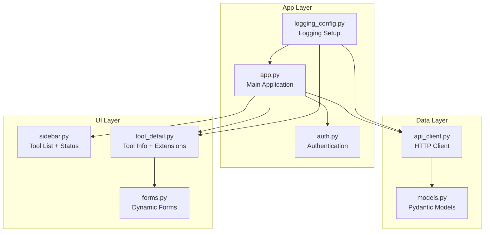
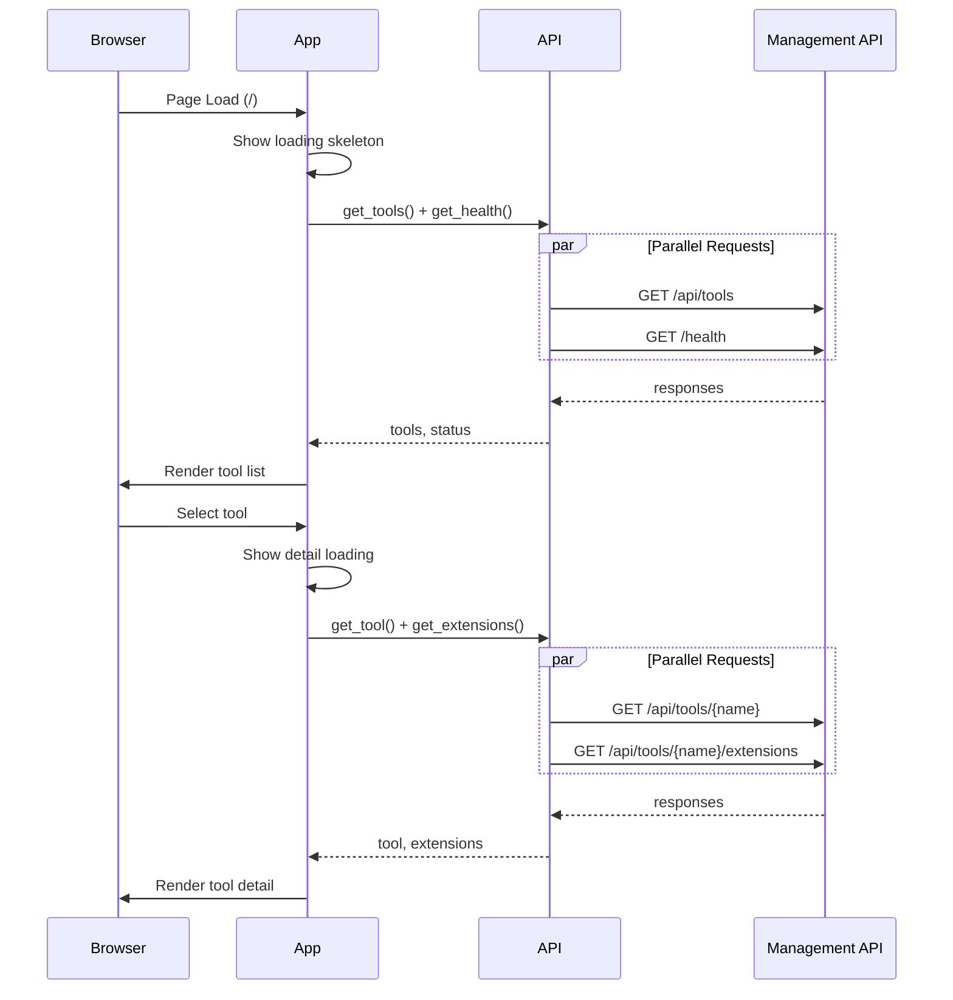

# mcp_ui Rebuild Plan

## Executive Summary

The mcp_ui (Management UI) requires a complete rebuild to address blocking issues, missing logging, and architectural complexity. This plan provides a structured approach to rebuild the UI with simplicity, non-blocking patterns, and comprehensive logging as core principles.

**Related Documents:**
- [`plans/nicegui_management_ui_plan.md`](nicegui_management_ui_plan.md) - Original implementation plan
- [`plans/ui_layout_design.md`](ui_layout_design.md) - UI layout specifications

---

## 1. Current State Analysis

### 1.1 Feature Inventory

| Feature | Description | Current Status |
|---------|-------------|----------------|
| Tool Listing | Display all registered MCP tools in sidebar | ✅ Working |
| Tool Status Display | Show status (running/stopped/error/healthy/degraded/unhealthy) | ✅ Working |
| Tool Selection | Click to select and view details | ✅ Working |
| Tool Detail View | Display name, status, endpoints, capabilities | ✅ Working |
| Data Sources Panel | Query read-only data sources, display tables | ✅ Working |
| Mutators Panel | Dynamic configuration forms from JSON schema | ✅ Working |
| Actions Panel | Execute actions with confirmation dialogs | ✅ Working |
| Authentication | Username/password via environment variables | ✅ Working |
| Dark Mode | Theme support | ✅ Working |
| Auto-refresh | Timer-based refresh | ⚠️ Workaround |

### 1.2 Current Architecture

```
mcp_ui/
├── management_ui.py      # Main entry point (358 lines)
├── api_client.py         # HTTP client (331 lines)
├── auth.py               # Authentication (188 lines)
├── models.py             # Pydantic models (110 lines)
├── state.py              # State management (71 lines)
└── components/
    ├── tool_list.py      # Sidebar list (97 lines)
    ├── tool_card.py      # Detail card (130 lines)
    ├── data_sources_box.py  # Read-only display (152 lines)
    ├── mutators_box.py   # Config forms (114 lines)
    └── actions_box.py    # Action buttons (81 lines)
```

**Total: ~1,632 lines of code**

---

## 2. Issues Identified

### 2.1 Critical: Timer Workaround for NiceGUI Timeout

**Location:** [`mcp_ui/management_ui.py:196-201`](../mcp_ui/management_ui.py:196)

```python
# DEFERRING API CALL: Don't block page render with initial API call
if initial_load and not state.tools and not state.tools_loading:
    async def schedule_refresh():
        await _refresh_tools()
    ui.timer(0.1, schedule_refresh, once=True)
```

**Problem:** API calls during page render exceed NiceGUI's 3-second timeout.
**Root Cause:** Sequential API calls, no proper loading state management.

### 2.2 Sequential API Calls (Blocking)

**Location:** [`mcp_ui/management_ui.py:233-244`](../mcp_ui/management_ui.py:233)

```python
# These execute sequentially, blocking each other
extensions = await get_api_client().get_extensions(state.selected_tool)
selected_tool_detail = await get_api_client().get_tool(state.selected_tool)
```

**Problem:** Two API calls execute sequentially when they could run in parallel.
**Fix:** Use `asyncio.gather()` for parallel execution.

### 2.3 Global State Management Issues

**Location:** [`mcp_ui/state.py:44-57`](../mcp_ui/state.py:44)

```python
_client_states: Dict[int, AppState] = {}

def get_state() -> AppState:
    try:
        client_id = context.client.id
        if client_id not in _client_states:
            _client_states[client_id] = AppState()
        return _client_states[client_id]
    except Exception:
        return _global_state  # Fallback causes state bleeding
```

**Problems:**
1. Memory leak - states never cleaned up when clients disconnect
2. Race conditions in concurrent access
3. Fallback to global state causes state bleeding between clients

### 2.4 Unnecessary Page Navigation

**Location:** [`mcp_ui/management_ui.py:254-271`](../mcp_ui/management_ui.py:254)

```python
async def on_query(...):
    await get_api_client().query_extension(...)
    ui.notify("Query successful", type='positive')
    ui.navigate.to('/')  # Unnecessary full page refresh
```

**Problem:** Navigating to `/` after every action refreshes the entire page.
**Fix:** Use local component refresh with `ui.refreshable`.

### 2.5 Missing Logging

| File | Logging Status | Severity |
|------|----------------|----------|
| `api_client.py` | ❌ None | **CRITICAL** |
| `state.py` | ❌ None | **HIGH** |
| `components/data_sources_box.py` | ❌ None | **MEDIUM** |
| `components/mutators_box.py` | ❌ None | **MEDIUM** |
| `components/actions_box.py` | ❌ None | **MEDIUM** |
| `management_ui.py` | ⚠️ Minimal | **MEDIUM** |
| `auth.py` | ⚠️ Minimal | **LOW** |

---

## 3. Rebuild Principles

### 3.1 Simplicity

- Reduce file count from 9 to 6 files
- Use NiceGUI's native storage instead of custom state management
- Consolidate related components

### 3.2 Non-Blocking UI

- All API calls must be parallelizable
- Show loading states immediately
- Use background tasks for long operations
- Never block the main event loop

### 3.3 Comprehensive Logging

- Every module has a logger
- Log all API requests/responses
- Log state transitions
- Log user actions
- Include timing information

### 3.4 Debuggability

- Clear visibility into UI interactions
- Trace ID for request tracking
- Structured logging format
- Easy to enable debug mode

---

## 4. Proposed Architecture

### 4.1 New File Structure

```
mcp_ui/
├── __init__.py           # Package init
├── app.py                # Main application (replaces management_ui.py)
├── api_client.py         # HTTP client (improved)
├── auth.py               # Authentication (simplified)
├── models.py             # Pydantic models (unchanged)
├── logging_config.py     # NEW: Centralized logging setup
└── components/
    ├── __init__.py       # Component exports
    ├── sidebar.py        # NEW: Merged tool_list
    ├── tool_detail.py    # NEW: Merged tool_card + all extension boxes
    └── forms.py          # NEW: Shared form generation
```

**Reduction: 9 files → 8 files (with better separation)**

### 4.2 Component Architecture



### 4.3 Data Flow



---

## 5. Implementation Phases

### Phase 1: Foundation (Days 1-2)

**Goal:** Set up core infrastructure with proper logging

#### Tasks

- [ ] Create `logging_config.py` with structured logging
- [ ] Add logging to `api_client.py`
- [ ] Add request/response timing
- [ ] Add trace ID generation
- [ ] Create `app.py` skeleton with logging

#### Logging Configuration

```python
# logging_config.py
import logging
import sys
from datetime import datetime

class StructuredFormatter(logging.Formatter):
    def format(self, record):
        return (
            f"{datetime.utcnow().isoformat()} | "
            f"{record.levelname:8} | "
            f"{record.name:20} | "
            f"{record.getMessage()}"
        )

def setup_logging(level: str = "DEBUG"):
    handler = logging.StreamHandler(sys.stdout)
    handler.setFormatter(StructuredFormatter())
    
    root_logger = logging.getLogger()
    root_logger.setLevel(level)
    root_logger.addHandler(handler)
    
    # Set specific loggers
    logging.getLogger("httpx").setLevel(logging.WARNING)
    logging.getLogger("nicegui").setLevel(logging.INFO)
```

#### API Client Logging

```python
# api_client.py additions
import logging
import time
import uuid

logger = logging.getLogger(__name__)

class ManagementAPIClient:
    async def _request_with_retry(self, method: str, path: str, **kwargs) -> Any:
        trace_id = str(uuid.uuid4())[:8]
        start_time = time.time()
        
        logger.debug(f"[{trace_id}] --> {method} {path}")
        
        for attempt in range(self.max_retries):
            try:
                # ... existing code ...
                elapsed = (time.time() - start_time) * 1000
                logger.debug(f"[{trace_id}] <-- {response.status_code} ({elapsed:.1f}ms)")
                return response.json()
            except Exception as e:
                logger.warning(f"[{trace_id}] Retry {attempt + 1}/{self.max_retries}: {e}")
        
        logger.error(f"[{trace_id}] Request failed after {self.max_retries} retries")
```

### Phase 2: State Management (Day 3)

**Goal:** Replace global state with NiceGUI native storage

#### Tasks

- [ ] Remove `state.py` global dictionary
- [ ] Use `app.storage.user` for state persistence
- [ ] Add state transition logging
- [ ] Implement proper cleanup on disconnect

#### New State Approach

```python
# app.py - Use NiceGUI storage directly
from nicegui import app

@dataclass
class AppState:
    selected_tool: Optional[str] = None
    tools: List[ToolInfo] = field(default_factory=list)
    extensions: Dict[str, List[Extension]] = field(default_factory=dict)
    connection_status: str = "connected"

def get_state() -> AppState:
    """Get state from NiceGUI user storage."""
    state_dict = app.storage.user.get('app_state', {})
    return AppState(**state_dict) if state_dict else AppState()

def save_state(state: AppState) -> None:
    """Save state to NiceGUI user storage."""
    logger.debug(f"Saving state: selected={state.selected_tool}")
    app.storage.user['app_state'] = asdict(state)
```

### Phase 3: Non-Blocking Patterns (Days 4-5)

**Goal:** Eliminate blocking patterns and timer workarounds

#### Tasks

- [ ] Implement loading skeleton pattern
- [ ] Parallelize API calls with `asyncio.gather()`
- [ ] Add request cancellation on navigation
- [ ] Remove timer workaround

#### Loading Skeleton Pattern

```python
# app.py
@ui.page('/')
async def main_page():
    # Show loading immediately
    with ui.column().classes('w-full') as container:
        ui.spinner().classes('mx-auto')
        ui.label('Loading tools...').classes('text-grey')
    
    # Load data in background
    try:
        tools, health = await asyncio.gather(
            get_api_client().get_tools(),
            get_api_client().get_health()
        )
    except APIError as e:
        container.clear()
        ui.label(f'Connection error: {e}').classes('text-red')
        return
    
    # Render with data
    container.clear()
    state = get_state()
    state.tools = tools
    save_state(state)
    
    await render_main_ui(container, state)
```

#### Parallel API Calls

```python
# Current (sequential)
extensions = await get_api_client().get_extensions(tool_name)
tool_detail = await get_api_client().get_tool(tool_name)

# New (parallel)
extensions, tool_detail = await asyncio.gather(
    get_api_client().get_extensions(tool_name),
    get_api_client().get_tool(tool_name)
)
```

### Phase 4: Component Consolidation (Days 6-7)

**Goal:** Simplify component structure

#### Tasks

- [ ] Create `sidebar.py` (merge tool_list functionality)
- [ ] Create `tool_detail.py` (merge tool_card + extension boxes)
- [ ] Create `forms.py` (extract form generation logic)
- [ ] Add component-level logging

#### New Component Structure

```python
# components/sidebar.py
from nicegui import ui
import logging

logger = logging.getLogger(__name__)

def render_sidebar(state: AppState, on_select: Callable, on_refresh: Callable) -> None:
    """Render the sidebar with tool list."""
    logger.debug(f"Rendering sidebar with {len(state.tools)} tools")
    
    with ui.column().classes('w-full'):
        # Header
        with ui.row().classes('w-full justify-between items-center mb-2'):
            ui.label('Tools').classes('text-h6')
            ui.button(icon='refresh', on_click=on_refresh).props('flat dense')
        
        # Loading state
        if state.tools_loading:
            ui.spinner().classes('mx-auto')
            return
        
        # Tool list
        for tool in state.tools:
            _render_tool_item(tool, state.selected_tool == tool.name, on_select)

def _render_tool_item(tool: ToolInfo, is_selected: bool, on_select: Callable) -> None:
    """Render a single tool item."""
    logger.debug(f"Rendering tool item: {tool.name} (selected={is_selected})")
    
    classes = 'w-full cursor-pointer p-2 rounded'
    if is_selected:
        classes += ' bg-blue-100 dark:bg-blue-900'
    
    with ui.button(on_click=lambda: on_select(tool.name)).props('flat').classes(classes):
        ui.label(tool.name).classes('font-medium')
        _status_badge(tool.status)
```

```python
# components/forms.py
from nicegui import ui
import logging
from typing import Dict, Any, Callable

logger = logging.getLogger(__name__)

def generate_form(schema: Dict[str, Any]) -> Callable[[], Dict[str, Any]]:
    """Generate form fields from JSON schema."""
    logger.debug(f"Generating form from schema with {len(schema.get('properties', {}))} fields")
    
    inputs: Dict[str, Any] = {}
    properties = schema.get('input', {}).get('properties', {})
    
    for prop_name, prop_def in properties.items():
        prop_type = prop_def.get('type', 'string')
        logger.debug(f"Creating input for {prop_name} (type={prop_type})")
        
        inputs[prop_name] = _create_input(prop_name, prop_type, prop_def)
    
    return lambda: {name: widget.value for name, widget in inputs.items()}

def _create_input(name: str, prop_type: str, prop_def: Dict) -> Any:
    """Create appropriate input widget for property type."""
    label = prop_def.get('description', name)
    default = prop_def.get('default')
    
    if prop_type == 'integer':
        return ui.number(label, value=default or 0).classes('w-full mb-2')
    elif prop_type == 'boolean':
        return ui.switch(label, value=default or False).classes('w-full mb-2')
    elif prop_type == 'array':
        return ui.textarea(label, value=','.join(default) if default else '').classes('w-full mb-2')
    else:
        return ui.input(label, value=default or '').classes('w-full mb-2')
```

### Phase 5: Local Refresh (Day 8)

**Goal:** Remove unnecessary page navigation

#### Tasks

- [ ] Implement `ui.refreshable` for content areas
- [ ] Replace `ui.navigate.to('/')` with local refresh
- [ ] Add refresh logging

#### Refreshable Pattern

```python
# app.py
@ui.page('/')
async def main_page():
    state = get_state()
    
    @ui.refreshable
    def content_area():
        """Refreshable content area."""
        logger.debug("Refreshing content area")
        render_tool_detail(state)
    
    async def on_action_complete():
        """Called after mutations/actions complete."""
        logger.info("Action complete, refreshing content")
        content_area.refresh()
    
    # Pass callback to components
    render_main_ui(state, on_refresh=content_area.refresh)
```

### Phase 6: Testing & Documentation (Days 9-10)

**Goal:** Ensure reliability and maintainability

#### Tasks

- [ ] Write unit tests for API client
- [ ] Write integration tests for components
- [ ] Update README.md
- [ ] Create troubleshooting guide
- [ ] Add inline documentation

---

## 6. Detailed File Specifications

### 6.1 `app.py` (Main Application)

**Purpose:** Main entry point, page routes, UI orchestration

**Key Functions:**
- `main_page()` - Main page route with loading skeleton
- `login_page()` - Login route
- `render_main_ui()` - Render header, sidebar, content
- `handle_tool_select()` - Tool selection handler
- `handle_refresh()` - Refresh handler

**Logging:**
- Page load/unload
- Tool selection changes
- Refresh triggers
- Error conditions

### 6.2 `api_client.py` (HTTP Client)

**Purpose:** HTTP communication with Management API

**Key Changes:**
- Add comprehensive logging
- Add trace ID for request tracking
- Add timing information
- Improve error messages

**Logging:**
- Request start (method, path, trace ID)
- Request complete (status, timing)
- Retry attempts
- Error details

### 6.3 `logging_config.py` (Logging Setup)

**Purpose:** Centralized logging configuration

**Features:**
- Structured log format
- Configurable log level
- Trace ID support
- Module-specific levels

### 6.4 `components/sidebar.py`

**Purpose:** Tool list sidebar

**Merges:** `tool_list.py`

**Features:**
- Tool list rendering
- Status badges
- Selection highlighting
- Loading state

### 6.5 `components/tool_detail.py`

**Purpose:** Tool detail view with extensions

**Merges:** `tool_card.py`, `data_sources_box.py`, `mutators_box.py`, `actions_box.py`

**Features:**
- Tool information display
- Data sources panel
- Mutators panel
- Actions panel
- Extension type routing

### 6.6 `components/forms.py`

**Purpose:** Dynamic form generation

**Extracted from:** `mutators_box.py`, `actions_box.py`

**Features:**
- JSON schema to form conversion
- Type-specific inputs
- Validation support
- Value collection

---

## 7. Environment Variables

| Variable | Default | Description |
|----------|---------|-------------|
| `MCP_UI_PORT` | 9092 | UI server port |
| `MCP_UI_THEME` | dark | Theme (dark/light/system) |
| `MCP_UI_USERNAME` | admin | Login username |
| `MCP_UI_PASSWORD` | (none) | Login password (required for auth) |
| `MCP_UI_SECRET` | (random) | Session secret |
| `MCP_API_URL` | http://localhost:9091 | Management API URL |
| `MCP_API_KEY` | (none) | API key (optional) |
| `MCP_API_TIMEOUT` | 10.0 | API timeout in seconds |
| `MCP_UI_LOG_LEVEL` | DEBUG | Logging level |

---

## 8. Success Criteria

### 8.1 Functional Requirements

- [ ] All existing features work correctly
- [ ] Tool list loads and refreshes
- [ ] Tool selection shows details
- [ ] Data sources query correctly
- [ ] Mutators update configuration
- [ ] Actions execute with confirmation
- [ ] Authentication works
- [ ] Dark mode works

### 8.2 Non-Functional Requirements

- [ ] Page loads in < 1 second
- [ ] No UI freezing during API calls
- [ ] All API calls have logging
- [ ] State transitions are logged
- [ ] Error messages are helpful
- [ ] Code is < 1,500 lines (reduced from 1,632)

### 8.3 Debuggability Requirements

- [ ] Every API request has trace ID
- [ ] State changes are logged
- [ ] User actions are logged
- [ ] Errors include context
- [ ] Debug mode can be enabled via environment

---

## 9. Risk Mitigation

| Risk | Mitigation |
|------|------------|
| Breaking existing functionality | Comprehensive testing before deployment |
| API changes | Version API client, add compatibility checks |
| Performance regression | Benchmark before/after, add timing logs |
| State loss during migration | Keep backward compatibility layer |
| Logging overhead | Make log level configurable, async logging |

---

## 10. Timeline

```
Week 1:
  Day 1-2: Phase 1 (Foundation + Logging)
  Day 3: Phase 2 (State Management)
  Day 4-5: Phase 3 (Non-Blocking Patterns)

Week 2:
  Day 6-7: Phase 4 (Component Consolidation)
  Day 8: Phase 5 (Local Refresh)
  Day 9-10: Phase 6 (Testing & Documentation)
```

---

## 11. Checklist Summary

### Phase 1: Foundation
- [ ] Create `logging_config.py`
- [ ] Add logging to `api_client.py`
- [ ] Add request/response timing
- [ ] Add trace ID generation
- [ ] Create `app.py` skeleton

### Phase 2: State Management
- [ ] Remove global state dictionary
- [ ] Use `app.storage.user`
- [ ] Add state transition logging
- [ ] Implement cleanup

### Phase 3: Non-Blocking Patterns
- [ ] Loading skeleton pattern
- [ ] Parallelize API calls
- [ ] Request cancellation
- [ ] Remove timer workaround

### Phase 4: Component Consolidation
- [ ] Create `sidebar.py`
- [ ] Create `tool_detail.py`
- [ ] Create `forms.py`
- [ ] Add component logging

### Phase 5: Local Refresh
- [ ] Implement `ui.refreshable`
- [ ] Remove page navigation
- [ ] Add refresh logging

### Phase 6: Testing & Documentation
- [ ] Unit tests
- [ ] Integration tests
- [ ] Update README
- [ ] Troubleshooting guide

---

## 12. References

- [NiceGUI Documentation](https://nicegui.io/)
- [NiceGUI Best Practices](https://nicegui.io/documentation/best_practices)
- [httpx Async Client](https://www.python-httpx.org/async/)
- [Pydantic V2 Documentation](https://docs.pydantic.dev/latest/)

---

*Document Version: 1.0*
*Created: 2026-03-27*
*Status: Ready for Implementation*
