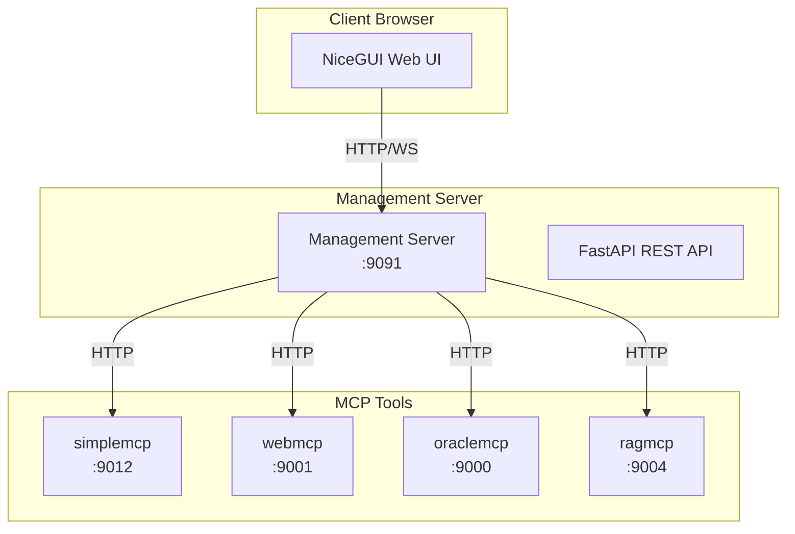
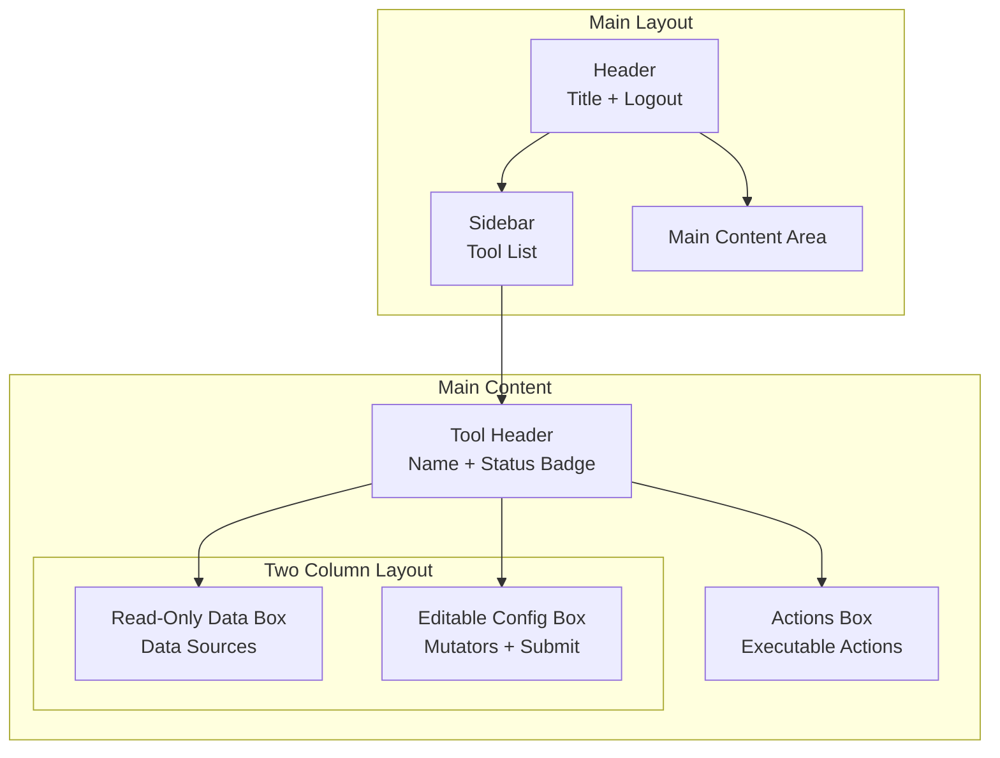
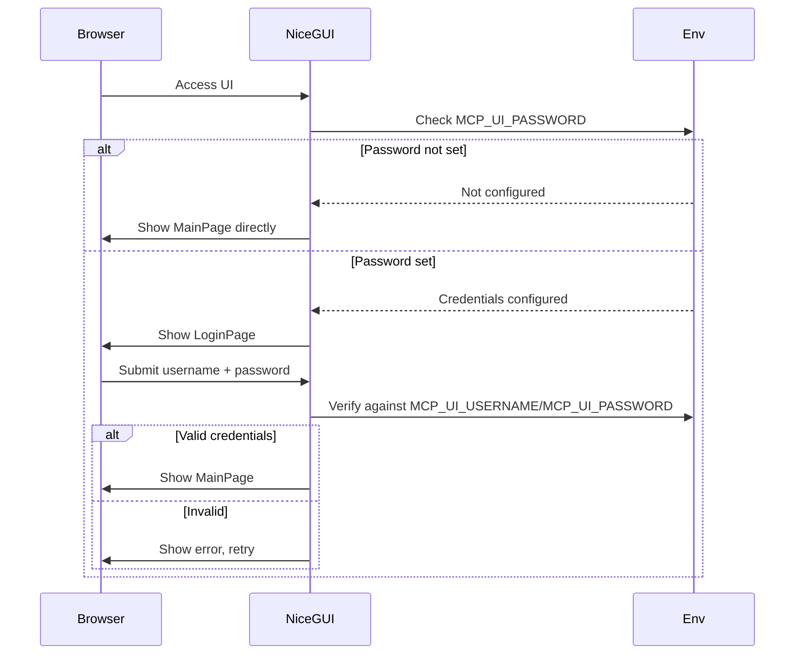
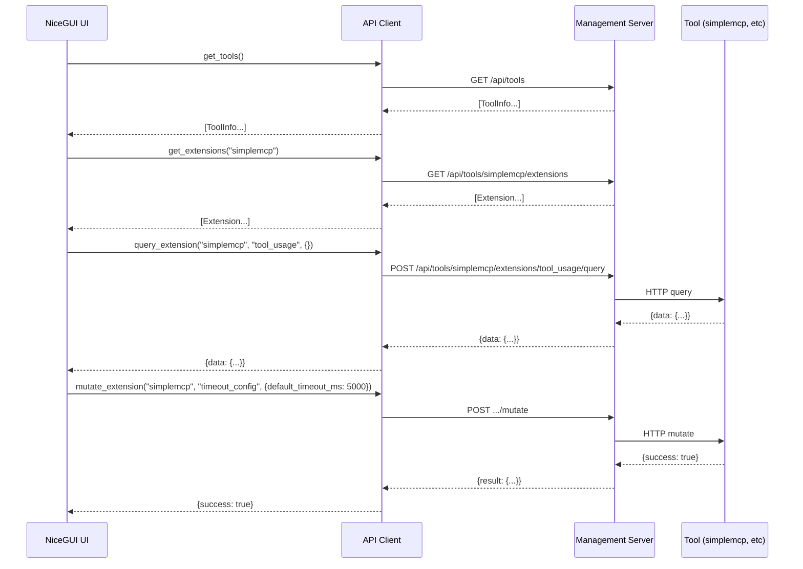
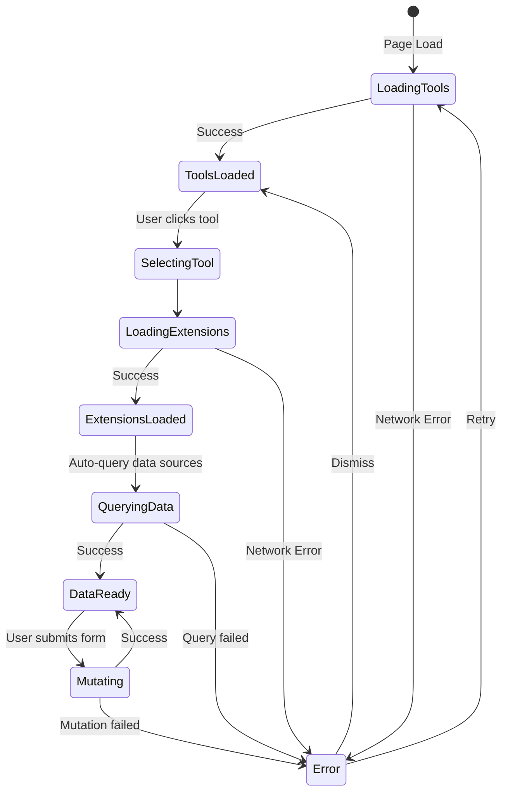

# NiceGUI Management UI Development Plan

> **⚠ HISTORICAL — superseded 2026-08-30 by the mcp_ui overhaul (ac3c189..a22b6d0).** Describes the pre-overhaul UI; unchecked boxes below are not pending work. Live tracker: `TODO.md` (repo root, local-only).

## Context

The MCP tools management system has a centralized management server (`launcher/management_server.py`) that provides REST API endpoints for:
- Listing all tools and their status
- Querying data source extensions (read-only)
- Mutating configuration via mutator extensions
- Executing actions
- Real-time event streaming via WebSocket

The goal is to build a NiceGUI-based web UI that provides a visual management interface for this system.

---

## 1. System Architecture Overview

### 1.1 High-Level Architecture



### 1.2 Components

| Component | Purpose | Location |
|-----------|---------|----------|
| NiceGUI App | Main web UI application | `ui/management_ui.py` |
| Auth Handler | Login/password authentication | `ui/auth.py` |
| API Client | HTTP client for management API | `ui/api_client.py` |
| Tool Card | Individual tool display component | `ui/components/tool_card.py` |
| Extension Panel | Extension details & controls | `ui/components/extension_panel.py` |
| Config | UI configuration (auth, server) | `config/launcher_config.json` |

### 1.3 Management API Endpoints

| Endpoint | Method | Purpose |
|----------|--------|---------|
| `/health` | GET | System health & tool list |
| `/api/tools` | GET | List all tools with status |
| `/api/tools/{name}` | GET | Get specific tool details |
| `/api/tools/{name}/extensions` | GET | List tool's extensions |
| `/api/tools/{name}/extensions/{ext}/query` | POST | Query data source |
| `/api/tools/{name}/extensions/{ext}/mutate` | POST | Update configuration |
| `/api/tools/{name}/extensions/{ext}/execute` | POST | Execute action |

---

## 2. UI Layout & Component Structure

### 2.1 Page Structure



### 2.2 Component Hierarchy

```
App
├── LoginPage (shown if auth configured)
│   ├── UsernameInput
│   ├── PasswordInput
│   └── LoginButton
│
└── MainPage (shown after login)
    ├── Header
    │   ├── Title
    │   └── LogoutButton
    │
    ├── MainLayout (columns)
    │   ├── LeftSidebar
    │   │   └── ToolList
    │   │       └── ToolListItem (per tool)
    │   │
    │   └── ContentArea
    │       ├── ToolDetailCard
    │       │   ├── ToolHeader (name, status)
    │       │   │
    │       │   ├── DataSourcesBox (read-only)
    │       │   │   ├── SectionTitle
    │       │   │   └── DataTable (key-value)
    │       │   │
    │       │   ├── MutatorsBox (editable)
    │       │   │   ├── SectionTitle
    │       │   │   ├── DynamicForm (per mutator)
    │       │   │   └── SubmitButton
    │       │   │
    │       │   └── ActionsBox
    │       │       ├── SectionTitle
    │       │       └── ActionButton (per action)
    │       │
    │       └── StatusBar (connection status)
    │
    └── Notifications (toast messages)
```

### 2.3 NiceGUI Widgets Selection

| UI Element | NiceGUI Widget | Rationale |
|------------|----------------|------------|
| Login form | `ui.input_text` + `ui.button` | Simple, standard |
| Tool list | `ui.list` + `ui.item` | Native list behavior |
| Status badge | `ui.badge` | Visual status indication |
| Read-only data | `ui.table` or `ui.tree` | Structured data display |
| Editable fields | `ui.input`, `ui.number`, `ui.select` | Based on schema type |
| Submit button | `ui.button` with loading state | Clear action |
| Notifications | `ui.notify` | Built-in toast notifications |
| Refresh | `ui.button` + `ui.timer` | Auto-refresh capability |
| Layout | `ui.column`, `ui.row`, `ui.grid` | Flexible positioning |

---

## 3. Authentication Flow

### 3.1 Authentication Modes

1. **No Auth Mode**: If no password is set (environment variable not set), skip login page entirely
2. **Auth Mode**: If credentials are set via environment variables, require login before accessing UI

### 3.2 Authentication Configuration

**Security Context**: This UI is designed for local/intranet use only (127.0.0.1, localhost, or trusted internal network). No HTTPS, no internet exposure.

```bash
# Set credentials via environment variables
# If MCP_UI_PASSWORD is not set, no login is required
export MCP_UI_USERNAME="admin"    # Optional, defaults to "admin"
export MCP_UI_PASSWORD="your_password"
```

**Auth behavior**:
- `MCP_UI_PASSWORD` not set → Login page is skipped, direct access to main UI
- `MCP_UI_PASSWORD` set → Login page shown, username and password required
- `MCP_UI_USERNAME` optional, defaults to "admin" if not set

### 3.3 Auth Flow Diagram



### 3.4 Session Management

- Use NiceGUI's built-in `ui.context.client.storage` for session state
- Store `authenticated: bool` per client
- Session timeout: configurable, default 30 minutes

**Note**: Since this UI is for local/intranet use only, client-side session storage is acceptable.

---

## 4. API Integration Approach

### 4.1 HTTP Client

```python
class ManagementAPIClient:
    def __init__(self, base_url: str, api_key: str = None):
        self.base_url = base_url
        self.api_key = api_key
        self.headers = {"Authorization": f"Bearer {api_key}"} if api_key else {}
    
    async def get_tools(self) -> List[ToolInfo]
    async def get_tool(self, name: str) -> ToolInfo
    async def get_extensions(self, name: str) -> List[Extension]
    async def query_extension(self, tool: str, ext: str, params: dict) -> Any
    async def mutate_extension(self, tool: str, ext: str, params: dict) -> Any
    async def execute_extension(self, tool: str, ext: str, params: dict) -> Any
```

### 4.2 Data Flow



### 4.3 Error Handling

| Error Type | UI Behavior |
|------------|-------------|
| Network error | Show "Connection lost" notification, auto-retry |
| 401 Unauthorized (API) | Show "API authentication failed" notification (separate from UI login) |
| 404 Not found | Show "Tool not found" in UI |
| 400 Bad request | Show validation error message |
| 500 Server error | Show "Server error" notification |
| Circuit breaker open | Show "Tool temporarily unavailable" |

**Note on 401 errors**: The Management API uses optional Bearer token authentication (api_key). If the API returns 401, it means the API's authentication failed - this is separate from the UI's username/password login. The UI login controls access to the web interface, while the API key controls access to the Management API endpoints.

---

## 5. Implementation Phases

### Phase 1: Project Setup
- [ ] Create `ui/` directory structure
- [ ] Add NiceGUI to `requirements.txt`
- [ ] Create `ui/__init__.py`
- [ ] Create basic `ui/management_ui.py` with app skeleton
- [ ] Add configuration schema to `config/launcher_config.json`

### Phase 2: Authentication
- [ ] Create `ui/auth.py` with password verification
- [ ] Implement login page with `ui.input_text` and `ui.button`
- [ ] Add session management using client storage
- [ ] Create auth decorator for protected routes
- [ ] Add logout functionality

### Phase 3: Core UI Layout
- [ ] Implement main layout with sidebar and content area
- [ ] Create tool list in sidebar with status indicators
- [ ] Implement tool selection and detail view
- [ ] Add header with title and logout button
- [ ] Implement responsive grid layout

### Phase 4: Tool Display Components
- [ ] Create `ToolCard` component for tool details
- [ ] Implement status badge with color coding
- [ ] Create `DataSourcesBox` with read-only table display
- [ ] Implement `MutatorsBox` with dynamic form generation
- [ ] Create `ActionsBox` with action buttons

### Phase 5: API Integration
- [ ] Create `ui/api_client.py` with all API methods
- [ ] Implement auto-refresh with `ui.timer`
- [ ] Add manual refresh buttons
- [ ] Implement optimistic UI updates for mutations
- [ ] Add error handling with user-friendly messages

### Phase 6: Visual Polish
- [ ] Apply NiceGUI theming (dark/light mode)
- [ ] Add loading spinners during async operations
- [ ] Implement toast notifications
- [ ] Add connection status indicator
- [ ] Improve spacing and typography

### Phase 7: Testing & Documentation
- [ ] Write unit tests for API client
- [ ] Write integration tests
- [ ] Add inline documentation
- [ ] Create README for UI module

---

## 6. File Structure

```
supreme-mcp-tools/
├── ui/
│   ├── __init__.py
│   ├── management_ui.py          # Main NiceGUI application
│   ├── auth.py                    # Authentication handling
│   ├── api_client.py              # Management API HTTP client
│   └── components/
│       ├── __init__.py
│       ├── tool_card.py           # Tool detail display
│       ├── data_sources_box.py    # Read-only data panel
│       ├── mutators_box.py        # Editable config panel
│       ├── actions_box.py          # Action execution panel
│       └── tool_list.py           # Sidebar tool list
├── config/
│   └── launcher_config.json       # Main config (add ui section)
├── plans/
│   └── nicegui_management_ui_plan.md
└── requirements.txt               # Add nicegui
```

---

## 7. Configuration Schema

### Additions to `config/launcher_config.json`

```json
{
  "managementUI": {
    "enabled": true,
    "host": "0.0.0.0",
    "port": 9092,
    "theme": "dark",
    "autoRefresh": true,
    "refreshIntervalSeconds": 30
  },
  "fefV3": {
    "managementServer": {
      "host": "0.0.0.0",
      "port": 9091
    }
  }
}
```

**Authentication**: Credentials are set via environment variables:
- `MCP_UI_USERNAME`: Optional, defaults to "admin"
- `MCP_UI_PASSWORD`: Required for authentication. If not set, no login is required.

### Configuration Notes

- **Port**: Separate port (9092) for web UI, distinct from management API (9091)
- **Theme**: `dark` (default), `light`, or `system`
- **Auto-refresh**: When enabled, tool status refreshes automatically
- **Credentials**: Set via environment variables
  - `MCP_UI_USERNAME`: Optional, defaults to "admin"
  - `MCP_UI_PASSWORD`: If not set, login page is skipped (no authentication)
  - This is intentional for local development and trusted networks

---

## 8. Key Design Decisions

| Decision | Rationale |
|----------|----------|
| Standalone NiceGUI app | Decoupled from management server, easier deployment |
| Separate port (9092) | Better separation of concerns from management API |
| Credentials via env vars | Simpler security model for local/intranet use |
| No HTTPS | Designed for local/trusted network only (127.0.0.1, localhost) |
| Dark theme by default | User preference, with light/system options |
| Configurable auto-refresh | User can choose automatic or manual refresh |
| Client-side state | NiceGUI handles state per-client automatically |
| Dynamic form generation | Adapts to extension schemas without hardcoding |
| Optimistic UI updates | Better perceived performance |
| No password = no login | Skip auth entirely if MCP_UI_PASSWORD not set |

---

## 9. Extension Schema Handling

### Data Source (Read-Only)
```python
{
    "type": "data_source",
    "schema": {
        "output": {
            "properties": {
                "double_count": {"type": "integer"},
                "total_tool_calls": {"type": "integer"}
            }
        }
    }
}
```
UI: Display as key-value table, auto-refresh button

### Mutator (Editable)
```python
{
    "type": "mutator",
    "schema": {
        "input": {
            "properties": {
                "default_timeout_ms": {"type": "integer", "minimum": 1000},
                "max_timeout_ms": {"type": "integer", "minimum": 5000}
            }
        }
    }
}
```
UI: Generate form fields from schema, submit button, validation

### Action (Executable)
```python
{
    "type": "action",
    "schema": {
        "input": {
            "properties": {
                "target": {"type": "string"}
            }
        }
    }
}
```
UI: Generate form + "Execute" button with confirmation

---

## 10. Implementation Summary

### Key Design Decisions (Final)

| Decision | Choice |
|----------|--------|
| Port | 9092 (separate from management API) |
| Theme | Dark by default, configurable to light/system |
| Credentials | `MCP_UI_USERNAME` (optional, default "admin") + `MCP_UI_PASSWORD` |
| Auth behavior | If no password set, login is skipped |
| Auto-refresh | User configurable (enabled by default) |
| Security | Local/intranet only - no HTTPS, no internet exposure |

### File Structure Summary

```
ui/
├── __init__.py
├── management_ui.py          # Main NiceGUI app
├── auth.py                   # Auth handling
├── api_client.py             # API HTTP client
└── components/
    ├── __init__.py
    ├── tool_card.py          # Tool detail card
    ├── data_sources_box.py   # Read-only data
    ├── mutators_box.py       # Editable config
    ├── actions_box.py         # Action buttons
    └── tool_list.py          # Sidebar list
```

### Next Steps

The plan is ready for implementation. To proceed:

1. **Code mode** can implement Phase 1-7 in sequence
2. Each phase produces working code that can be tested
3. Implementation follows the architecture diagrams and component structure

---

## 11. Data Models (Pydantic)

These models define the data structures used throughout the UI. Place them in `ui/models.py`.

### 11.1 Core Models

```python
from pydantic import BaseModel
from typing import Any, Dict, List, Optional
from datetime import datetime
from enum import Enum


class ToolStatus(str, Enum):
    """Tool status enum."""
    RUNNING = "running"
    STOPPED = "stopped"
    ERROR = "error"
    UNKNOWN = "unknown"


class ExtensionType(str, Enum):
    """Extension type enum."""
    DATA_SOURCE = "data_source"
    MUTATOR = "mutator"
    ACTION = "action"


class ToolInfo(BaseModel):
    """Information about a tool."""
    name: str
    status: ToolStatus
    management_url: Optional[str] = None
    mcp_port: Optional[int] = None
    capabilities: List[str] = []
    last_check: Optional[datetime] = None


class ExtensionSchema(BaseModel):
    """Schema definition for an extension."""
    type: ExtensionType
    name: str
    description: Optional[str] = None
    schema: Dict[str, Any] = {}  # JSON Schema for input/output


class Extension(BaseModel):
    """An extension with its schema and current state."""
    name: str
    type: ExtensionType
    schema: Dict[str, Any] = {}
    description: Optional[str] = None
    data: Optional[Dict[str, Any]] = None  # For data sources


class ToolDetail(BaseModel):
    """Detailed tool information with extensions."""
    name: str
    status: ToolStatus
    management_url: Optional[str] = None
    mcp_port: Optional[int] = None
    capabilities: List[str] = []
    last_check: Optional[datetime] = None
    registered_at: Optional[datetime] = None
    extensions: List[Extension] = []


class APIResponse(BaseModel):
    """Generic API response wrapper."""
    success: bool
    data: Optional[Any] = None
    error: Optional[str] = None
```

### 11.2 UI State Models

```python
class UIState(BaseModel):
    """Global UI state (per-client, managed by NiceGUI)."""
    selected_tool: Optional[str] = None
    is_loading: bool = False
    connection_status: str = "connected"  # connected, disconnected, error
    last_refresh: Optional[datetime] = None
    error_message: Optional[str] = None


class LoginForm(BaseModel):
    """Login form data."""
    username: str = ""
    password: str = ""


class MutatorForm(BaseModel):
    """Dynamic mutator form data."""
    extension_name: str
    values: Dict[str, Any] = {}
```

---

## 12. API Client Implementation

Complete implementation for `ui/api_client.py`.

### 12.1 Full API Client Code

```python
"""
Management API Client

HTTP client for communicating with the Management Server.
"""

import asyncio
import logging
from typing import Any, Dict, List, Optional

import httpx

from .models import ToolInfo, ToolDetail, Extension, ToolStatus

logger = logging.getLogger(__name__)


class APIError(Exception):
    """Custom API error."""
    def __init__(self, message: str, status_code: Optional[int] = None):
        self.message = message
        self.status_code = status_code
        super().__init__(message)


class ManagementAPIClient:
    """
    HTTP client for the Management Server API.
    
    Usage:
        client = ManagementAPIClient("http://localhost:9091")
        tools = await client.get_tools()
    """
    
    def __init__(
        self,
        base_url: str = "http://localhost:9091",
        api_key: Optional[str] = None,
        timeout: float = 30.0,
        max_retries: int = 3,
        retry_delay: float = 1.0
    ):
        self.base_url = base_url.rstrip("/")
        self.api_key = api_key
        self.timeout = timeout
        self.max_retries = max_retries
        self.retry_delay = retry_delay
        
        self.headers = {}
        if api_key:
            self.headers["Authorization"] = f"Bearer {api_key}"
        
        self._client: Optional[httpx.AsyncClient] = None
    
    async def _get_client(self) -> httpx.AsyncClient:
        """Get or create HTTP client."""
        if self._client is None:
            self._client = httpx.AsyncClient(
                base_url=self.base_url,
                headers=self.headers,
                timeout=self.timeout
            )
        return self._client
    
    async def close(self):
        """Close the HTTP client."""
        if self._client:
            await self._client.aclose()
            self._client = None
    
    async def _request_with_retry(
        self,
        method: str,
        path: str,
        **kwargs
    ) -> Dict[str, Any]:
        """Make request with retry logic."""
        client = await self._get_client()
        last_error = None
        
        for attempt in range(self.max_retries):
            try:
                response = await client.request(method, path, **kwargs)
                
                if response.status_code == 401:
                    raise APIError("API authentication failed", 401)
                
                if response.status_code == 404:
                    raise APIError(f"Resource not found: {path}", 404)
                
                if response.status_code >= 500:
                    raise APIError(f"Server error: {response.status_code}", response.status_code)
                
                response.raise_for_status()
                return response.json()
                
            except httpx.NetworkError as e:
                last_error = APIError(f"Network error: {e}")
                logger.warning(f"Network error on attempt {attempt + 1}: {e}")
                
            except httpx.HTTPStatusError as e:
                raise APIError(f"HTTP error: {e}", e.response.status_code)
            
            except APIError:
                raise
            
            except Exception as e:
                last_error = APIError(f"Unexpected error: {e}")
                logger.error(f"Unexpected error: {e}")
            
            if attempt < self.max_retries - 1:
                await asyncio.sleep(self.retry_delay * (attempt + 1))
        
        raise last_error or APIError("Unknown error")
    
    async def get_health(self) -> Dict[str, Any]:
        """Get system health status."""
        return await self._request_with_retry("GET", "/health")
    
    async def get_tools(self) -> List[ToolInfo]:
        """List all available tools."""
        data = await self._request_with_retry("GET", "/api/tools")
        return [ToolInfo(**tool) for tool in data.get("tools", [])]
    
    async def get_tool(self, name: str) -> ToolDetail:
        """Get details of a specific tool."""
        data = await self._request_with_retry("GET", f"/api/tools/{name}")
        return ToolDetail(**data)
    
    async def get_extensions(self, tool_name: str) -> List[Extension]:
        """List extensions for a tool."""
        data = await self._request_with_retry(
            "GET", 
            f"/api/tools/{tool_name}/extensions"
        )
        return [Extension(**ext) for ext in data.get("extensions", [])]
    
    async def query_extension(
        self,
        tool_name: str,
        extension_name: str,
        params: Optional[Dict[str, Any]] = None
    ) -> Dict[str, Any]:
        """Query a data source extension."""
        data = await self._request_with_retry(
            "POST",
            f"/api/tools/{tool_name}/extensions/{extension_name}/query",
            json={"params": params or {}}
        )
        return data.get("data", {})
    
    async def mutate_extension(
        self,
        tool_name: str,
        extension_name: str,
        params: Dict[str, Any]
    ) -> Dict[str, Any]:
        """Mutate configuration via extension."""
        data = await self._request_with_retry(
            "POST",
            f"/api/tools/{tool_name}/extensions/{extension_name}/mutate",
            json={"params": params}
        )
        return data.get("result", {})
    
    async def execute_extension(
        self,
        tool_name: str,
        extension_name: str,
        params: Optional[Dict[str, Any]] = None
    ) -> Dict[str, Any]:
        """Execute an action extension."""
        data = await self._request_with_retry(
            "POST",
            f"/api/tools/{tool_name}/extensions/{extension_name}/execute",
            json={"params": params or {}}
        )
        return data.get("result", {})
```

---

## 13. Authentication Implementation

Complete implementation for `ui/auth.py`.

### 13.1 Auth Handler Code

```python
"""
Authentication Handler

Handles username/password authentication via environment variables.
"""

import os
import logging
from functools import wraps
from typing import Optional

from nicegui import ui, context

logger = logging.getLogger(__name__)

# Environment variable names
ENV_USERNAME = "MCP_UI_USERNAME"
ENV_PASSWORD = "MCP_UI_PASSWORD"

# Default username if password is set but username is not
DEFAULT_USERNAME = "admin"

# Session timeout in seconds (30 minutes)
SESSION_TIMEOUT = 30 * 60


def get_credentials() -> tuple[Optional[str], Optional[str]]:
    """
    Get credentials from environment variables.
    
    Returns:
        Tuple of (username, password) or (None, None) if not configured.
    """
    password = os.environ.get(ENV_PASSWORD)
    if not password:
        return None, None
    
    username = os.environ.get(ENV_USERNAME, DEFAULT_USERNAME)
    return username, password


def is_auth_enabled() -> bool:
    """Check if authentication is enabled."""
    return os.environ.get(ENV_PASSWORD) is not None


def verify_credentials(username: str, password: str) -> bool:
    """
    Verify credentials against environment variables.
    
    Args:
        username: The username to verify
        password: The password to verify
    
    Returns:
        True if credentials are valid, False otherwise.
    """
    expected_username, expected_password = get_credentials()
    
    if expected_password is None:
        # No password configured, allow access
        return True
    
    return (
        username == expected_username and
        password == expected_password
    )


def is_authenticated() -> bool:
    """Check if current client is authenticated."""
    if not is_auth_enabled():
        return True
    
    storage = context.client.storage
    return storage.get("authenticated", False)


def set_authenticated(value: bool = True):
    """Set authentication state for current client."""
    storage = context.client.storage
    storage["authenticated"] = value


def logout():
    """Clear authentication state for current client."""
    storage = context.client.storage
    storage["authenticated"] = False


def require_auth(func):
    """
    Decorator to require authentication for a function.
    
    If auth is not enabled, the function is called directly.
    If auth is enabled but user is not authenticated, redirects to login.
    """
    @wraps(func)
    async def wrapper(*args, **kwargs):
        if not is_auth_enabled():
            return await func(*args, **kwargs)
        
        if not is_authenticated():
            ui.open("/login")
            return
        
        return await func(*args, **kwargs)
    
    return wrapper
```

### 13.2 Login Page Component

```python
def create_login_page():
    """Create the login page UI."""
    with ui.card().classes("absolute-center w-96"):
        ui.label("Management UI Login").classes("text-h5 mb-4")
        
        username = ui.input(
            "Username",
            placeholder="Enter username"
        ).classes("w-full mb-2")
        
        password = ui.input(
            "Password",
            password=True,
            placeholder="Enter password"
        ).classes("w-full mb-4")
        
        error_label = ui.label("").classes("text-red-500 mb-2")
        
        async def handle_login():
            if verify_credentials(username.value, password.value):
                set_authenticated(True)
                ui.open("/")
            else:
                error_label.text = "Invalid credentials"
                password.value = ""
        
        ui.button("Login", on_click=handle_login).classes("w-full")
```

---

## 14. State Management

### 14.1 State Management Approach

NiceGUI handles state per-client automatically. Use `ui.context.client.storage` for persistent state and regular Python variables for transient state within a page.

```python
from nicegui import ui, context
from typing import Optional, Dict, Any
from dataclasses import dataclass, field


@dataclass
class AppState:
    """
    Application state for a single client.
    
    This is NOT a Pydantic model - it's a dataclass that holds
    transient UI state. NiceGUI manages per-client instances.
    """
    # Tool selection
    selected_tool: Optional[str] = None
    
    # Loading states
    tools_loading: bool = False
    extensions_loading: bool = False
    mutation_loading: bool = False
    
    # Connection status
    connection_status: str = "connected"  # connected, disconnected, error
    
    # Cached data
    tools: list = field(default_factory=list)
    extensions: Dict[str, list] = field(default_factory=dict)
    
    # Error handling
    error_message: Optional[str] = None
    
    # Last refresh time
    last_refresh: Optional[str] = None


# Global state dictionary keyed by client.id
# Note: NiceGUI's context.client.storage is preferred for persistence
_client_states: Dict[int, AppState] = {}


def get_state() -> AppState:
    """Get or create state for current client."""
    client_id = context.client.id
    if client_id not in _client_states:
        _client_states[client_id] = AppState()
    return _client_states[client_id]


def clear_state():
    """Clear state for current client."""
    client_id = context.client.id
    if client_id in _client_states:
        del _client_states[client_id]
```

### 14.2 State Flow Diagram



---

## 15. Component Interfaces

### 15.1 Component Props and Events

Each component should follow these interfaces:

#### ToolList Component (`ui/components/tool_list.py`)

```python
from nicegui import ui
from typing import List, Callable, Optional
from ..models import ToolInfo, ToolStatus


def ToolList(
    tools: List[ToolInfo],
    selected_tool: Optional[str] = None,
    on_select: Optional[Callable[[str], None]] = None,
    on_refresh: Optional[Callable[[], None]] = None,
    loading: bool = False
) -> None:
    """
    Render the tool list sidebar.
    
    Args:
        tools: List of tools to display
        selected_tool: Name of currently selected tool
        on_select: Callback when a tool is selected (receives tool name)
        on_refresh: Callback when refresh button is clicked
        loading: Show loading state
    """
    with ui.column().classes("w-full"):
        # Header with refresh button
        with ui.row().classes("w-full justify-between items-center mb-2"):
            ui.label("Tools").classes("text-h6")
            if on_refresh:
                ui.button(icon="refresh", on_click=on_refresh).props(
                    "flat dense"
                ).bind_enabled_from(lambda: not loading)
        
        if loading:
            ui.spinner().classes("mx-auto")
            return
        
        # Tool list
        with ui.list().classes("w-full"):
            for tool in tools:
                _tool_list_item(tool, tool.name == selected_tool, on_select)


def _tool_list_item(
    tool: ToolInfo,
    is_selected: bool,
    on_select: Optional[Callable[[str], None]]
) -> None:
    """Render a single tool list item."""
    classes = "w-full cursor-pointer p-2 rounded"
    if is_selected:
        classes += " bg-blue-100 dark:bg-blue-900"
    
    with ui.item().classes(classes).on("click", lambda: on_select(tool.name) if on_select else None):
        with ui.item_section():
            ui.label(tool.name).classes("font-medium")
        with ui.item_section().classes("items-end"):
            _status_badge(tool.status)


def _status_badge(status: ToolStatus) -> None:
    """Render status badge."""
    color_map = {
        ToolStatus.RUNNING: "green",
        ToolStatus.STOPPED: "grey",
        ToolStatus.ERROR: "red",
        ToolStatus.UNKNOWN: "orange"
    }
    ui.badge(status.value, color=color_map.get(status, "grey"))
```

#### ToolCard Component (`ui/components/tool_card.py`)

```python
from nicegui import ui
from typing import List, Dict, Any, Callable, Optional
from ..models import ToolDetail, Extension, ExtensionType


def ToolCard(
    tool: Optional[ToolDetail],
    on_query: Optional[Callable[[str, Dict[str, Any]], None]] = None,
    on_mutate: Optional[Callable[[str, Dict[str, Any]], None]] = None,
    on_execute: Optional[Callable[[str, Dict[str, Any]], None]] = None,
    loading: bool = False
) -> None:
    """
    Render tool detail card with extensions.
    
    Args:
        tool: Tool details to display (None if no tool selected)
        on_query: Callback for data source queries (extension_name, params)
        on_mutate: Callback for mutator submissions (extension_name, params)
        on_execute: Callback for action executions (extension_name, params)
        loading: Show loading state
    """
    if tool is None:
        ui.label("Select a tool to view details").classes(
            "text-grey text-center p-8"
        )
        return
    
    with ui.card().classes("w-full"):
        # Tool header
        with ui.row().classes("w-full justify-between items-center mb-4"):
            ui.label(tool.name).classes("text-h5")
            _status_badge(tool.status)
        
        if loading:
            ui.spinner().classes("mx-auto")
            return
        
        if not tool.extensions:
            ui.label("No extensions available").classes("text-grey")
            return
        
        # Separate extensions by type
        data_sources = [e for e in tool.extensions if e.type == ExtensionType.DATA_SOURCE]
        mutators = [e for e in tool.extensions if e.type == ExtensionType.MUTATOR]
        actions = [e for e in tool.extensions if e.type == ExtensionType.ACTION]
        
        # Two-column layout for data sources and mutators
        with ui.grid().classes("w-full grid-cols-2 gap-4"):
            # Data sources (read-only)
            if data_sources:
                _data_sources_box(data_sources, on_query)
            
            # Mutators (editable)
            if mutators:
                _mutators_box(mutators, on_mutate)
        
        # Actions (full width)
        if actions:
            _actions_box(actions, on_execute)
```

#### DataSourcesBox Component (`ui/components/data_sources_box.py`)

```python
from nicegui import ui
from typing import List, Dict, Any, Callable, Optional
from ..models import Extension


def DataSourcesBox(
    extensions: List[Extension],
    on_query: Optional[Callable[[str], None]] = None,
    on_refresh: Optional[Callable[[str], None]] = None
) -> None:
    """
    Render read-only data sources box.
    
    Args:
        extensions: List of data source extensions
        on_query: Callback to query an extension (receives extension name)
        on_refresh: Callback to refresh an extension's data
    """
    with ui.card().classes("w-full"):
        ui.label("Data Sources").classes("text-h6 mb-2")
        
        for ext in extensions:
            with ui.expansion(ext.name, icon="storage").classes("w-full"):
                if ext.description:
                    ui.label(ext.description).classes("text-grey mb-2")
                
                if ext.data:
                    # Display as key-value table
                    _data_table(ext.data)
                else:
                    ui.label("No data available").classes("text-grey")
                
                # Refresh button
                if on_refresh:
                    ui.button(
                        "Refresh",
                        icon="refresh",
                        on_click=lambda e=ext.name: on_refresh(e)
                    ).props("flat dense")


def _data_table(data: Dict[str, Any]) -> None:
    """Render data as a key-value table."""
    rows = [{"key": k, "value": str(v)} for k, v in data.items()]
    
    ui.table(
        columns=[
            {"name": "key", "label": "Property", "field": "key"},
            {"name": "value", "label": "Value", "field": "value"}
        ],
        rows=rows,
        row_key="key"
    ).classes("w-full").props("flat dense")
```

#### MutatorsBox Component (`ui/components/mutators_box.py`)

```python
from nicegui import ui
from typing import List, Dict, Any, Callable, Optional
from ..models import Extension


def MutatorsBox(
    extensions: List[Extension],
    on_submit: Optional[Callable[[str, Dict[str, Any]], None]] = None,
    loading: bool = False
) -> None:
    """
    Render editable mutators box with dynamic forms.
    
    Args:
        extensions: List of mutator extensions
        on_submit: Callback for form submission (extension_name, values)
        loading: Show loading state
    """
    with ui.card().classes("w-full"):
        ui.label("Configuration").classes("text-h6 mb-2")
        
        for ext in extensions:
            with ui.expansion(ext.name, icon="settings").classes("w-full"):
                if ext.description:
                    ui.label(ext.description).classes("text-grey mb-2")
                
                # Generate form from schema
                form_values = _generate_form(ext.schema)
                
                # Submit button
                ui.button(
                    "Apply Changes",
                    icon="save",
                    on_click=lambda e=ext.name, v=form_values: (
                        on_submit(e, v()) if on_submit else None
                    )
                ).bind_enabled_from(lambda: not loading)


def _generate_form(schema: Dict[str, Any]) -> Callable[[], Dict[str, Any]]:
    """
    Generate form fields from JSON schema.
    
    Returns a callable that returns current form values.
    """
    inputs = {}
    properties = schema.get("input", {}).get("properties", {})
    
    for prop_name, prop_def in properties.items():
        prop_type = prop_def.get("type", "string")
        label = prop_def.get("description", prop_name)
        default = prop_def.get("default")
        
        if prop_type == "integer":
            inputs[prop_name] = ui.number(
                label,
                value=default or 0,
                min=prop_def.get("minimum"),
                max=prop_def.get("maximum")
            ).classes("w-full mb-2")
        
        elif prop_type == "number":
            inputs[prop_name] = ui.number(
                label,
                value=default or 0.0,
                min=prop_def.get("minimum"),
                max=prop_def.get("maximum"),
                format="%.2f"
            ).classes("w-full mb-2")
        
        elif prop_type == "boolean":
            inputs[prop_name] = ui.switch(
                label,
                value=default or False
            ).classes("w-full mb-2")
        
        elif prop_type == "array":
            # For arrays, use a textarea with comma-separated values
            inputs[prop_name] = ui.textarea(
                label,
                value=",".join(default) if default else ""
            ).classes("w-full mb-2")
        
        else:  # string and others
            inputs[prop_name] = ui.input(
                label,
                value=default or ""
            ).classes("w-full mb-2")
    
    def get_values() -> Dict[str, Any]:
        return {name: input.value for name, input in inputs.items()}
    
    return get_values
```

#### ActionsBox Component (`ui/components/actions_box.py`)

```python
from nicegui import ui
from typing import List, Dict, Any, Callable, Optional
from ..models import Extension


def ActionsBox(
    extensions: List[Extension],
    on_execute: Optional[Callable[[str, Dict[str, Any]], None]] = None,
    loading: bool = False
) -> None:
    """
    Render actions box with execute buttons.
    
    Args:
        extensions: List of action extensions
        on_execute: Callback for action execution (extension_name, params)
        loading: Show loading state
    """
    with ui.card().classes("w-full"):
        ui.label("Actions").classes("text-h6 mb-2")
        
        for ext in extensions:
            with ui.expansion(ext.name, icon="play_arrow").classes("w-full"):
                if ext.description:
                    ui.label(ext.description).classes("text-grey mb-2")
                
                # Generate form from schema (if any input required)
                form_values = _generate_action_form(ext.schema)
                
                # Execute button with confirmation
                ui.button(
                    "Execute",
                    icon="play_arrow",
                    color="primary",
                    on_click=lambda e=ext.name, v=form_values: (
                        _confirm_and_execute(e, v, on_execute)
                    )
                ).bind_enabled_from(lambda: not loading)


def _generate_action_form(schema: Dict[str, Any]) -> Callable[[], Dict[str, Any]]:
    """Generate form for action parameters (same as mutator form)."""
    # Reuse the same form generation logic from MutatorsBox
    from .mutators_box import _generate_form
    return _generate_form(schema)


async def _confirm_and_execute(
    extension_name: str,
    get_values: Callable[[], Dict[str, Any]],
    on_execute: Optional[Callable[[str, Dict[str, Any]], None]]
) -> None:
    """Show confirmation dialog and execute action."""
    with ui.dialog() as dialog, ui.card():
        ui.label(f"Execute {extension_name}?").classes("text-h6")
        ui.label("This action cannot be undone.").classes("text-grey mb-4")
        
        with ui.row():
            ui.button("Cancel", on_click=dialog.close).props("flat")
            ui.button(
                "Execute",
                color="primary",
                on_click=lambda: [
                    on_execute(extension_name, get_values()) if on_execute else None,
                    dialog.close()
                ]
            )
    
    dialog.open()
```

---

## 16. Main Application Structure

### 16.1 Main App Entry Point (`ui/management_ui.py`)

```python
"""
NiceGUI Management UI

Main entry point for the MCP Tools management web interface.
"""

import asyncio
import logging
from typing import Optional

from nicegui import ui, app

from .auth import (
    is_auth_enabled,
    is_authenticated,
    require_auth,
    logout,
    create_login_page
)
from .api_client import ManagementAPIClient
from .models import ToolInfo, ToolDetail
from .state import get_state, clear_state
from .components.tool_list import ToolList
from .components.tool_card import ToolCard

logger = logging.getLogger(__name__)

# Configuration defaults
DEFAULT_HOST = "0.0.0.0"
DEFAULT_PORT = 9092
DEFAULT_API_URL = "http://localhost:9091"
DEFAULT_THEME = "dark"
DEFAULT_REFRESH_INTERVAL = 30


class ManagementUI:
    """
    Main NiceGUI application for MCP Tools management.
    """
    
    def __init__(
        self,
        api_url: str = DEFAULT_API_URL,
        api_key: Optional[str] = None,
        theme: str = DEFAULT_THEME,
        refresh_interval: int = DEFAULT_REFRESH_INTERVAL
    ):
        self.api_url = api_url
        self.api_key = api_key
        self.theme = theme
        self.refresh_interval = refresh_interval
        
        self.client = ManagementAPIClient(api_url, api_key)
    
    def setup(self):
        """Setup the NiceGUI application."""
        # Apply theme
        ui.colors(primary="#1976d2")
        if self.theme == "dark":
            ui.dark_mode().enable()
        
        # Setup routes
        self._setup_routes()
    
    def _setup_routes(self):
        """Setup page routes."""
        
        @ui.page("/")
        async def main_page():
            """Main page - requires auth if enabled."""
            if is_auth_enabled() and not is_authenticated():
                ui.open("/login")
                return
            
            await self._render_main_page()
        
        @ui.page("/login")
        def login_page():
            """Login page."""
            if not is_auth_enabled():
                ui.open("/")
                return
            
            if is_authenticated():
                ui.open("/")
                return
            
            create_login_page()
        
        @app.get("/logout")
        def handle_logout():
            """Handle logout."""
            logout()
            return {"redirect": "/login"}
    
    async def _render_main_page(self):
        """Render the main management page."""
        state = get_state()
        
        # Page layout
        with ui.header().classes("w-full p-4 bg-primary"):
            with ui.row().classes("w-full justify-between items-center"):
                ui.label("MCP Tools Management").classes("text-h5 text-white")
                
                with ui.row():
                    # Connection status indicator
                    ui.icon("circle").classes(
                        "text-green-400"
                    ).bind_color_from(
                        lambda: "green" if state.connection_status == "connected" else "red"
                    )
                    
                    # Logout button (if auth enabled)
                    if is_auth_enabled():
                        ui.button(
                            "Logout",
                            icon="logout",
                            on_click=lambda: [logout(), ui.open("/login")]
                        ).props("flat color=white")
        
        # Main content with sidebar
        with ui.row().classes("w-full h-[calc(100vh-64px)]"):
            # Left sidebar - tool list
            with ui.column().classes("w-64 p-4 bg-gray-100 dark:bg-gray-800 overflow-auto"):
                await self._render_sidebar(state)
            
            # Main content area
            with ui.column().classes("flex-1 p-4 overflow-auto"):
                await self._render_content(state)
        
        # Auto-refresh timer
        ui.timer(self.refresh_interval, lambda: self._refresh_tools(state))
    
    async def _render_sidebar(self, state):
        """Render the sidebar with tool list."""
        async def on_select_tool(tool_name: str):
            state.selected_tool = tool_name
            await self._load_tool_extensions(state, tool_name)
        
        async def on_refresh():
            await self._refresh_tools(state)
        
        ToolList(
            tools=state.tools,
            selected_tool=state.selected_tool,
            on_select=on_select_tool,
            on_refresh=on_refresh,
            loading=state.tools_loading
        )
    
    async def _render_content(self, state):
        """Render the main content area."""
        if state.error_message:
            ui.notify(state.error_message, type="negative")
            state.error_message = None
        
        if not state.selected_tool:
            ui.label("Select a tool from the sidebar").classes(
                "text-grey text-center p-8 text-h6"
            )
            return
        
        # Get tool detail
        tool = next(
            (t for t in state.tools if t.name == state.selected_tool),
            None
        )
        
        async def on_query(ext_name: str, params: dict):
            await self._handle_query(state, ext_name, params)
        
        async def on_mutate(ext_name: str, params: dict):
            await self._handle_mutate(state, ext_name, params)
        
        async def on_execute(ext_name: str, params: dict):
            await self._handle_execute(state, ext_name, params)
        
        ToolCard(
            tool=tool,
            on_query=on_query,
            on_mutate=on_mutate,
            on_execute=on_execute,
            loading=state.extensions_loading
        )
    
    async def _refresh_tools(self, state):
        """Refresh the list of tools."""
        state.tools_loading = True
        try:
            state.tools = await self.client.get_tools()
            state.connection_status = "connected"
            state.last_refresh = datetime.now().isoformat()
        except Exception as e:
            logger.error(f"Failed to refresh tools: {e}")
            state.connection_status = "error"
            state.error_message = f"Failed to connect to management server: {e}"
        finally:
            state.tools_loading = False
    
    async def _load_tool_extensions(self, state, tool_name: str):
        """Load extensions for a specific tool."""
        state.extensions_loading = True
        try:
            extensions = await self.client.get_extensions(tool_name)
            # Update tool with extensions
            for i, tool in enumerate(state.tools):
                if tool.name == tool_name:
                    state.tools[i].extensions = extensions
                    break
        except Exception as e:
            logger.error(f"Failed to load extensions: {e}")
            state.error_message = f"Failed to load extensions: {e}"
        finally:
            state.extensions_loading = False
    
    async def _handle_query(self, state, ext_name: str, params: dict):
        """Handle data source query."""
        try:
            data = await self.client.query_extension(
                state.selected_tool, ext_name, params
            )
            # Update extension data in state
            ui.notify("Data refreshed", type="positive")
        except Exception as e:
            ui.notify(f"Query failed: {e}", type="negative")
    
    async def _handle_mutate(self, state, ext_name: str, params: dict):
        """Handle mutator submission."""
        state.mutation_loading = True
        try:
            result = await self.client.mutate_extension(
                state.selected_tool, ext_name, params
            )
            ui.notify("Configuration updated", type="positive")
        except Exception as e:
            ui.notify(f"Update failed: {e}", type="negative")
        finally:
            state.mutation_loading = False
    
    async def _handle_execute(self, state, ext_name: str, params: dict):
        """Handle action execution."""
        try:
            result = await self.client.execute_extension(
                state.selected_tool, ext_name, params
            )
            ui.notify(f"Action executed: {result}", type="positive")
        except Exception as e:
            ui.notify(f"Execution failed: {e}", type="negative")
    
    def run(self, host: str = DEFAULT_HOST, port: int = DEFAULT_PORT):
        """Run the NiceGUI application."""
        self.setup()
        ui.run(host=host, port=port, title="MCP Tools Management")


def main():
    """Entry point for running the management UI."""
    import os
    
    # Get configuration from environment
    api_url = os.environ.get("MCP_API_URL", DEFAULT_API_URL)
    api_key = os.environ.get("MCP_API_KEY")
    theme = os.environ.get("MCP_UI_THEME", DEFAULT_THEME)
    refresh_interval = int(os.environ.get("MCP_UI_REFRESH_INTERVAL", DEFAULT_REFRESH_INTERVAL))
    
    host = os.environ.get("MCP_UI_HOST", DEFAULT_HOST)
    port = int(os.environ.get("MCP_UI_PORT", DEFAULT_PORT))
    
    # Create and run app
    app = ManagementUI(
        api_url=api_url,
        api_key=api_key,
        theme=theme,
        refresh_interval=refresh_interval
    )
    app.run(host=host, port=port)


if __name__ == "__main__":
    main()
```

---

## 17. NiceGUI Best Practices

### 17.1 Widget Reference (Correct Names)

| UI Element | Correct NiceGUI Widget | Notes |
|------------|------------------------|-------|
| Text input | `ui.input()` | NOT `ui.input_text` |
| Password input | `ui.input(password=True)` | |
| Number input | `ui.number()` | |
| Text area | `ui.textarea()` | |
| Button | `ui.button()` | |
| Label | `ui.label()` | |
| Badge | `ui.badge()` | |
| Card | `ui.card()` | |
| List | `ui.list()` | |
| List item | `ui.item()` | |
| Expansion | `ui.expansion()` | Collapsible panel |
| Table | `ui.table()` | |
| Icon | `ui.icon()` | Material icons |
| Spinner | `ui.spinner()` | Loading indicator |
| Dialog | `ui.dialog()` | Modal dialog |
| Notify | `ui.notify()` | Toast notification |
| Timer | `ui.timer()` | Periodic callbacks |
| Column | `ui.column()` | Vertical layout |
| Row | `ui.row()` | Horizontal layout |
| Grid | `ui.grid()` | Grid layout |
| Dark mode | `ui.dark_mode()` | Theme control |

### 17.2 Data Binding

```python
# Bind value from a widget to a function
ui.label().bind_text_from(input_widget, 'value')

# Bind enabled state from a condition
ui.button().bind_enabled_from(lambda: not loading)

# Bind visibility
ui.card().bind_visibility_from(lambda: show_card)
```

### 17.3 Async Handlers

```python
# All click handlers can be async
async def handle_click():
    result = await api_client.get_tools()
    # Update UI

ui.button("Load", on_click=handle_click)
```

### 17.4 Client Storage

```python
from nicegui import context

# Store per-client data
storage = context.client.storage
storage["key"] = "value"
value = storage.get("key", default)
```

---

## 18. Testing Strategy

### 18.1 Unit Tests (API Client)

```python
# tests/test_api_client.py
import pytest
from unittest.mock import AsyncMock, patch
from ui.api_client import ManagementAPIClient, APIError
from ui.models import ToolInfo, ToolStatus


@pytest.fixture
def client():
    return ManagementAPIClient("http://localhost:9091")


@pytest.mark.asyncio
async def test_get_tools_success(client):
    with patch.object(client, '_request_with_retry') as mock:
        mock.return_value = {
            "tools": [
                {"name": "test_tool", "status": "running"}
            ]
        }
        
        tools = await client.get_tools()
        
        assert len(tools) == 1
        assert tools[0].name == "test_tool"
        assert tools[0].status == ToolStatus.RUNNING


@pytest.mark.asyncio
async def test_get_tools_network_error(client):
    with patch.object(client, '_request_with_retry') as mock:
        mock.side_effect = APIError("Network error")
        
        with pytest.raises(APIError):
            await client.get_tools()
```

### 18.2 Integration Tests

```python
# tests/test_integration.py
import pytest
from nicegui import ui
from ui.management_ui import ManagementUI


@pytest.fixture
def app():
    return ManagementUI(api_url="http://localhost:9091")


def test_main_page_renders(app):
    """Test that main page renders without errors."""
    # This would use NiceGUI's testing utilities
    pass
```

---

## 19. Requirements

Add to `requirements.txt`:

```
nicegui>=1.4.0
httpx>=0.25.0
pydantic>=2.0.0
```

---

## 20. Environment Variables Summary

| Variable | Default | Description |
|----------|---------|-------------|
| `MCP_UI_USERNAME` | `admin` | Username for UI login |
| `MCP_UI_PASSWORD` | (none) | Password for UI login. If not set, no login required |
| `MCP_API_URL` | `http://localhost:9091` | Management API base URL |
| `MCP_API_KEY` | (none) | API key for Management API (optional) |
| `MCP_UI_HOST` | `0.0.0.0` | Host to bind UI server |
| `MCP_UI_PORT` | `9092` | Port for UI server |
| `MCP_UI_THEME` | `dark` | UI theme: `dark`, `light`, or `system` |
| `MCP_UI_REFRESH_INTERVAL` | `30` | Auto-refresh interval in seconds |
