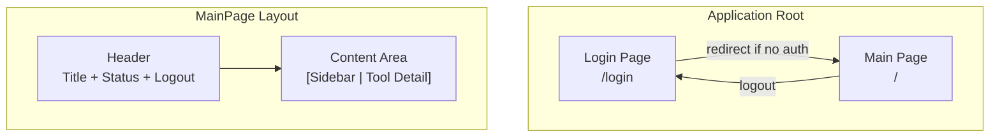
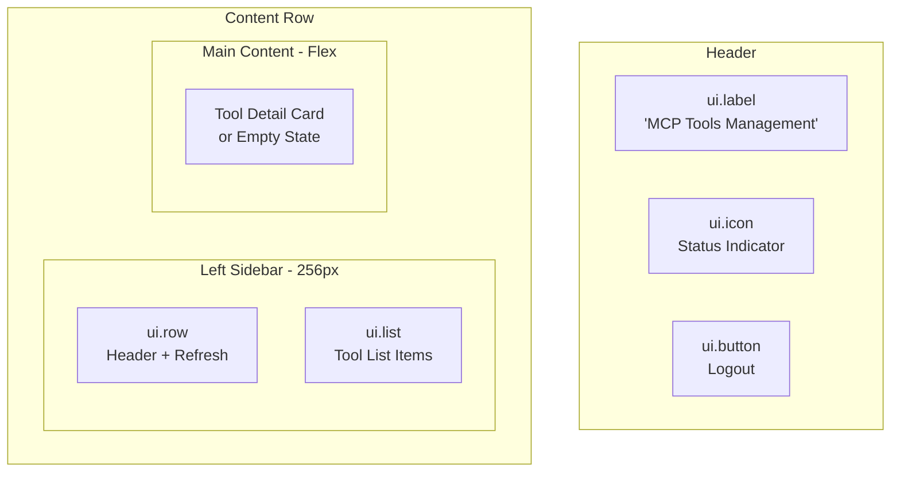
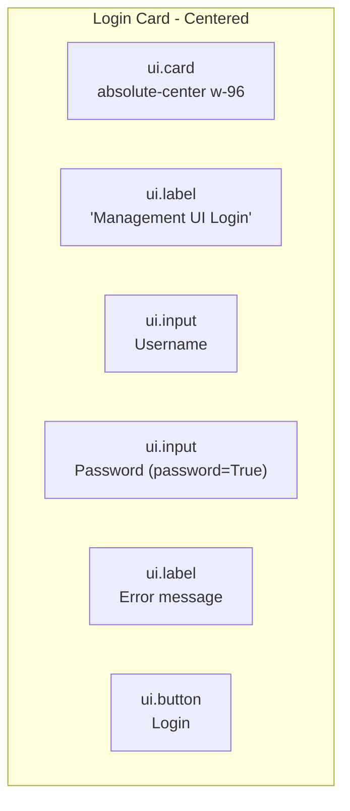
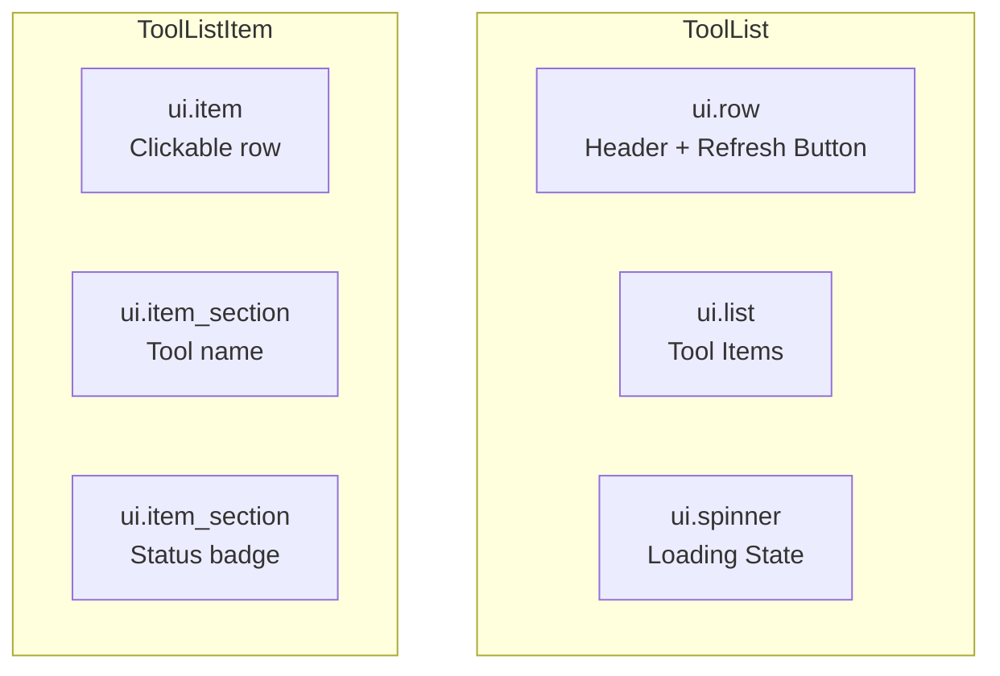
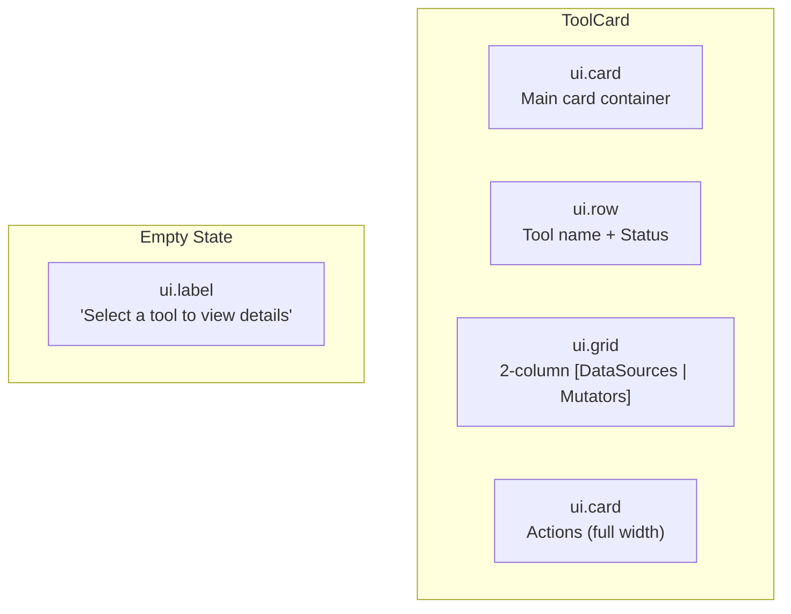
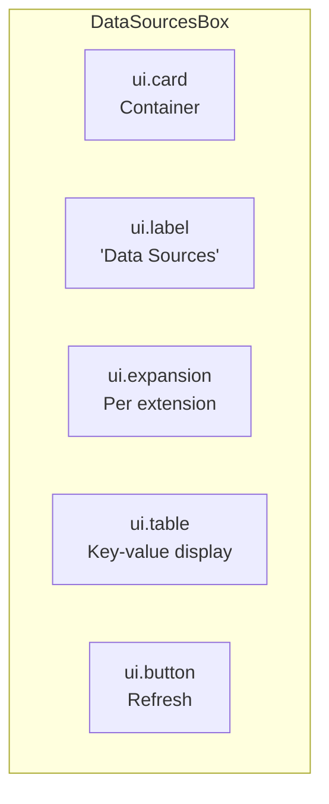
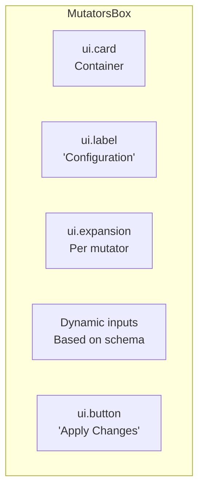
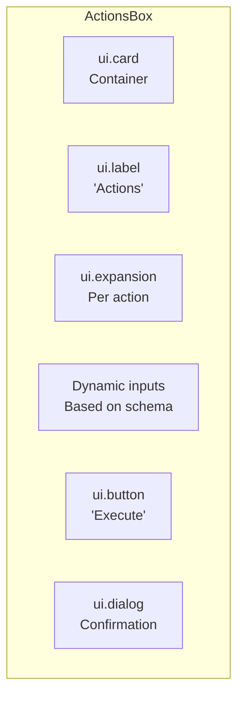

# NiceGUI Management UI - Layout Design Document

## Overview

This document provides a comprehensive UI layout specification for the NiceGUI Management UI. It defines the exact page structure, component layouts, CSS styling, and launch configuration needed to implement and run the web interface.

**Reference Documents:**
- [`plans/nicegui_management_ui_plan.md`](plans/nicegui_management_ui_plan.md) - Contains data models, API client, and authentication logic
- [`ui/models.py`](ui/models.py) - Pydantic models for UI state
- [`ui/state.py`](ui/state.py) - State management approach

**Supported Tools:** convertermcp, oraclemcp, ragmcp, simplemcp, webmcp

---

## Main Page Layout Visualization

```
┌─────────────────────────────────────────────────────────────────────────────┐
│ HEADER (bg-primary, p-4)                                                    │
│ ┌─────────────────────────────────────────────────────────────────────────┐ │
│ │ MCP Tools Management                              ● [Logout]           │ │
│ │ text-h5 text-white                          status icon   button       │ │
│ └─────────────────────────────────────────────────────────────────────────┘ │
├──────────────────────┬──────────────────────────────────────────────────────┤
│ SIDEBAR (w-64)       │ MAIN CONTENT (flex-1)                               │
│ bg-gray-100          │ p-4 overflow-auto                                   │
│ dark:bg-gray-800     │                                                      │
│ p-4 overflow-auto    │ ┌──────────────────────────────────────────────────┐ │
│                      │ │ TOOL CARD (w-full)                               │ │
│ ┌──────────────────┐ │ │                                                  │ │
│ │ Tools    [↻]     │ │ │ ┌──────────────────────────────────────────────┐ │ │
│ │ text-h6  refresh │ │ │ │ Tool Name                          [RUNNING] │ │ │
│ └──────────────────┘ │ │ │ text-h5                            badge     │ │ │
│                      │ │ └──────────────────────────────────────────────┘ │ │
│ ┌──────────────────┐ │ │                                                  │ │
│ │ ● simplemcp      │ │ │ ┌─────────────────────┐ ┌─────────────────────┐ │ │
│ │   [RUNNING]      │ │ │ │ DATA SOURCES        │ │ CONFIGURATION       │ │ │
│ │   (selected)     │ │ │ │ text-h6 mb-2        │ │ text-h6 mb-2        │ │ │
│ │   bg-blue-100    │ │ │ │                     │ │                     │ │ │
│ └──────────────────┘ │ │ │ ▼ tool_usage        │ │ ▼ timeout_config    │ │ │
│                      │ │ │   ┌───────────────┐ │ │   ┌───────────────┐ │ │ │
│ ┌──────────────────┐ │ │ │   │ double_count  │ │ │ │   │ Timeout (ms)  │ │ │
│ │ ○ webmcp         │ │ │ │   │ 42            │ │ │ │   │ [5000      ]  │ │ │
│ │   [RUNNING]      │ │ │ │   ├───────────────┤ │ │ │   │             │ │ │ │
│ └──────────────────┘ │ │ │   │ total_calls   │ │ │ │   │ [Apply]       │ │ │ │
│                      │ │ │ │   │ 128          │ │ │ │   └───────────────┘ │ │ │
│ ┌──────────────────┐ │ │ │   └───────────────┘ │ │ │                     │ │ │
│ │ ○ oraclemcp      │ │ │ │   [Refresh]        │ │ │                     │ │ │
│ │   [RUNNING]      │ │ │ │                     │ │ │                     │ │ │
│ └──────────────────┘ │ │ └─────────────────────┘ └─────────────────────┘ │ │
│                      │ │                                                      │
│ ┌──────────────────┐ │ │ ┌──────────────────────────────────────────────────┐ │
│ │ ○ ragmcp         │ │ │ │ ACTIONS                                          │ │
│ │   [RUNNING]      │ │ │ │ text-h6 mb-2                                     │ │
│ └──────────────────┘ │ │ │                                                  │ │
│                      │ │ │ ▼ clear_cache                                    │ │
│ ┌──────────────────┐ │ │ │   Description of action                          │ │
│ │ ○ convertermcp   │ │ │ │   [Execute]                                      │ │
│ │   [STOPPED]      │ │ │ │                                                  │ │
│ └──────────────────┘ │ │ └──────────────────────────────────────────────────┘ │
│                      │ └──────────────────────────────────────────────────────┘
└──────────────────────┴──────────────────────────────────────────────────────┘

Legend:
● = selected tool (bg-blue-100 dark:bg-blue-900)
○ = unselected tool
[RUNNING] = green badge
[STOPPED] = grey badge
[ERROR] = red badge
[UNKNOWN] = orange badge
```

---

## Login Page Layout Visualization

```
┌─────────────────────────────────────────────────────────────────────────────┐
│                                                                             │
│                                                                             │
│                                                                             │
│                     ┌─────────────────────────────┐                         │
│                     │ Management UI Login         │                         │
│                     │ text-h5 mb-4                │                         │
│                     │                             │                         │
│                     │ Username                    │                         │
│                     │ ┌─────────────────────────┐ │                         │
│                     │ │ Enter username          │ │                         │
│                     │ └─────────────────────────┘ │                         │
│                     │ w-full mb-2                 │                         │
│                     │                             │                         │
│                     │ Password                    │                         │
│                     │ ┌─────────────────────────┐ │                         │
│                     │ │ ••••••••                │ │                         │
│                     │ └─────────────────────────┘ │                         │
│                     │ w-full mb-4                 │                         │
│                     │                             │                         │
│                     │ Invalid credentials         │                         │
│                     │ text-red-500 mb-2           │                         │
│                     │                             │                         │
│                     │ ┌─────────────────────────┐ │                         │
│                     │ │        Login            │ │                         │
│                     │ └─────────────────────────┘ │                         │
│                     │ w-full                      │                         │
│                     └─────────────────────────────┘                         │
│                     absolute-center w-96                                  │
│                                                                             │
│                                                                             │
└─────────────────────────────────────────────────────────────────────────────┘
```

---

## 1. Page Structure Overview



### 1.1 Route Configuration

| Route | Purpose | Auth Required |
|-------|---------|---------------|
| `/` | Main management page | If `MCP_UI_PASSWORD` set |
| `/login` | Login page | No (redirects if already logged in) |

---

## 2. Main Page Layout

### 2.1 Page Structure



### 2.2 Main Layout Code Structure

```python
# ui/management_ui.py - Main page layout

@ui.page("/")
async def main_page():
    """Main management page with header, sidebar, and content area."""
    
    # === HEADER ===
    with ui.header().classes('w-full p-4 bg-primary'):
        with ui.row().classes('w-full justify-between items-center'):
            ui.label('MCP Tools Management').classes('text-h5 text-white')
            
            with ui.row():
                # Connection status icon
                ui.icon('circle').classes('text-green-400').bind_color_from(
                    lambda: 'green' if state.connection_status == 'connected' else 'red'
                )
                
                # Logout button (shown if auth enabled)
                if is_auth_enabled():
                    ui.button(
                        'Logout',
                        icon='logout',
                        on_click=lambda: [logout(), ui.open('/login')]
                    ).props('flat color=white')
    
    # === CONTENT ROW ===
    with ui.row().classes('w-full h-[calc(100vh-64px)]'):
        # Left sidebar
        with ui.column().classes('w-64 p-4 bg-gray-100 dark:bg-gray-800 overflow-auto'):
            await _render_sidebar(state)
        
        # Main content
        with ui.column().classes('flex-1 p-4 overflow-auto'):
            await _render_content(state)
```

### 2.3 CSS Classes Reference

| Element | Classes | Purpose |
|---------|---------|---------|
| Header | `w-full p-4 bg-primary` | Full width, padding, primary background |
| Header row | `w-full justify-between items-center` | Flexbox space-between alignment |
| Content row | `w-full h-[calc(100vh-64px)]` | Full viewport height minus header |
| Sidebar | `w-64 p-4 bg-gray-100 dark:bg-gray-800 overflow-auto` | Fixed 256px width, scrollable |
| Main content | `flex-1 p-4 overflow-auto` | Flexible width, scrollable |
| Title label | `text-h5 text-white` | Heading 5 size, white text |
| Status icon | `text-green-400` / `text-red-400` | Green or red based on status |

---

## 3. Login Page Layout

### 3.1 Page Structure



### 3.2 Login Page Code

```python
# ui/auth.py - Login page component

def create_login_page():
    """Create centered login card."""
    with ui.card().classes('absolute-center w-96'):
        ui.label('Management UI Login').classes('text-h5 mb-4')
        
        username = ui.input(
            'Username',
            placeholder='Enter username'
        ).classes('w-full mb-2')
        
        password = ui.input(
            'Password',
            password=True,
            placeholder='Enter password'
        ).classes('w-full mb-4')
        
        error_label = ui.label('').classes('text-red-500 mb-2')
        
        async def handle_login():
            if verify_credentials(username.value, password.value):
                set_authenticated(True)
                ui.open('/')
            else:
                error_label.text = 'Invalid credentials'
                password.value = ''
        
        ui.button('Login', on_click=handle_login).classes('w-full')
```

### 3.3 Login CSS Classes

| Element | Classes | Purpose |
|---------|---------|---------|
| Card | `absolute-center w-96` | Centered on screen, 384px width |
| Title | `text-h5 mb-4` | Heading 5, margin-bottom 16px |
| Username input | `w-full mb-2` | Full width, margin-bottom 8px |
| Password input | `w-full mb-4` | Full width, margin-bottom 16px |
| Error label | `text-red-500 mb-2` | Red text, margin-bottom 8px |
| Login button | `w-full` | Full width button |

---

## 4. Sidebar - ToolList Component

### 4.1 Component Structure



### 4.2 ToolList Component Code

```python
# ui/components/tool_list.py

from nicegui import ui
from typing import List, Callable, Optional
from ..models import ToolInfo, ToolStatus


def ToolList(
    tools: List[ToolInfo],
    selected_tool: Optional[str] = None,
    on_select: Optional[Callable[[str], None]] = None,
    on_refresh: Optional[Callable[[], None]] = None,
    loading: bool = False
) -> None:
    """Render the tool list sidebar."""
    
    with ui.column().classes('w-full'):
        # Header with refresh button
        with ui.row().classes('w-full justify-between items-center mb-2'):
            ui.label('Tools').classes('text-h6')
            if on_refresh:
                ui.button(
                    icon='refresh',
                    on_click=on_refresh
                ).props('flat dense').bind_enabled_from(
                    lambda: not loading
                )
        
        if loading:
            ui.spinner().classes('mx-auto')
            return
        
        # Tool list
        with ui.list().classes('w-full'):
            for tool in tools:
                _tool_list_item(tool, tool.name == selected_tool, on_select)


def _tool_list_item(
    tool: ToolInfo,
    is_selected: bool,
    on_select: Optional[Callable[[str], None]]
) -> None:
    """Render a single tool list item."""
    item_classes = 'w-full cursor-pointer p-2 rounded'
    if is_selected:
        item_classes += ' bg-blue-100 dark:bg-blue-900'
    
    with ui.item().classes(item_classes).on(
        'click', 
        lambda: on_select(tool.name) if on_select else None
    ):
        with ui.item_section():
            ui.label(tool.name).classes('font-medium')
        with ui.item_section().classes('items-end'):
            _status_badge(tool.status)


def _status_badge(status: ToolStatus) -> None:
    """Render status badge with color coding."""
    color_map = {
        ToolStatus.RUNNING: 'green',
        ToolStatus.STOPPED: 'grey',
        ToolStatus.ERROR: 'red',
        ToolStatus.UNKNOWN: 'orange'
    }
    ui.badge(status.value, color=color_map.get(status, 'grey'))
```

### 4.3 ToolList CSS Classes

| Element | Classes | Purpose |
|---------|---------|---------|
| Container | `w-full` | Full width of parent |
| Header row | `w-full justify-between items-center mb-2` | Flexbox alignment, margin |
| Title | `text-h6` | Heading 6 size |
| Refresh button | `flat dense` | Flat style, compact size |
| Tool item | `w-full cursor-pointer p-2 rounded` | Full width, pointer cursor, padding, rounded |
| Selected item | `bg-blue-100 dark:bg-blue-900` | Blue highlight for selected |
| Tool name | `font-medium` | Medium font weight |
| Badge container | `items-end` | Align to end (right) |

---

## 5. Main Content - ToolCard Component

### 5.1 Component Structure



### 5.2 ToolCard Component Code

```python
# ui/components/tool_card.py

from nicegui import ui
from typing import List, Dict, Any, Callable, Optional
from ..models import ToolDetail, Extension, ExtensionType


def ToolCard(
    tool: Optional[ToolDetail],
    on_query: Optional[Callable[[str, Dict[str, Any]], None]] = None,
    on_mutate: Optional[Callable[[str, Dict[str, Any]], None]] = None,
    on_execute: Optional[Callable[[str, Dict[str, Any]], None]] = None,
    loading: bool = False
) -> None:
    """Render tool detail card with extensions."""
    
    if tool is None:
        _render_empty_state()
        return
    
    with ui.card().classes('w-full'):
        # Tool header
        with ui.row().classes('w-full justify-between items-center mb-4'):
            ui.label(tool.name).classes('text-h5')
            _status_badge(tool.status)
        
        if loading:
            ui.spinner().classes('mx-auto')
            return
        
        if not tool.extensions:
            ui.label('No extensions available').classes('text-grey')
            return
        
        # Separate extensions by type
        data_sources = [e for e in tool.extensions if e.type == ExtensionType.DATA_SOURCE]
        mutators = [e for e in tool.extensions if e.type == ExtensionType.MUTATOR]
        actions = [e for e in tool.extensions if e.type == ExtensionType.ACTION]
        
        # Two-column grid for data sources and mutators
        with ui.grid().classes('w-full grid-cols-2 gap-4'):
            if data_sources:
                DataSourcesBox(data_sources, on_query=on_query)
            
            if mutators:
                MutatorsBox(mutators, on_submit=on_mutate, loading=loading)
        
        # Actions (full width)
        if actions:
            ActionsBox(actions, on_execute=on_execute, loading=loading)


def _render_empty_state():
    """Render empty state when no tool is selected."""
    ui.label('Select a tool from the sidebar').classes(
        'text-grey text-center p-8 text-h6'
    )


def _status_badge(status: ToolStatus) -> None:
    """Render status badge."""
    color_map = {
        ToolStatus.RUNNING: 'green',
        ToolStatus.STOPPED: 'grey',
        ToolStatus.ERROR: 'red',
        ToolStatus.UNKNOWN: 'orange'
    }
    ui.badge(status.value, color=color_map.get(status, 'grey'))
```

### 5.3 ToolCard CSS Classes

| Element | Classes | Purpose |
|---------|---------|---------|
| Card | `w-full` | Full width |
| Header row | `w-full justify-between items-center mb-4` | Flexbox alignment |
| Title | `text-h5` | Heading 5 size |
| Two-column grid | `w-full grid-cols-2 gap-4` | CSS grid, 2 columns, 16px gap |
| Spinner | `mx-auto` | Center horizontally |

---

## 6. DataSourcesBox Component (Read-Only)

### 6.1 Component Structure



### 6.2 DataSourcesBox Code

```python
# ui/components/data_sources_box.py

from nicegui import ui
from typing import List, Dict, Any, Callable, Optional
from ..models import Extension


def DataSourcesBox(
    extensions: List[Extension],
    on_query: Optional[Callable[[str], None]] = None,
    on_refresh: Optional[Callable[[str], None]] = None
) -> None:
    """Render read-only data sources box."""
    
    with ui.card().classes('w-full'):
        ui.label('Data Sources').classes('text-h6 mb-2')
        
        for ext in extensions:
            with ui.expansion(ext.name, icon='storage').classes('w-full'):
                if ext.description:
                    ui.label(ext.description).classes('text-grey mb-2')
                
                if ext.data:
                    _data_table(ext.data)
                else:
                    ui.label('No data available').classes('text-grey')
                
                if on_refresh:
                    ui.button(
                        'Refresh',
                        icon='refresh',
                        on_click=lambda e=ext.name: on_refresh(e)
                    ).props('flat dense')


def _data_table(data: Dict[str, Any]) -> None:
    """Render data as a key-value table."""
    rows = [{'key': k, 'value': str(v)} for k, v in data.items()]
    
    ui.table(
        columns=[
            {'name': 'key', 'label': 'Property', 'field': 'key'},
            {'name': 'value', 'label': 'Value', 'field': 'value'}
        ],
        rows=rows,
        row_key='key'
    ).classes('w-full').props('flat dense')
```

### 6.3 DataSourcesBox CSS Classes

| Element | Classes | Purpose |
|---------|---------|---------|
| Card | `w-full` | Full width |
| Section title | `text-h6 mb-2` | Heading 6, margin-bottom 8px |
| Expansion | `w-full` | Full width expansion panel |
| Description | `text-grey mb-2` | Grey text, margin-bottom |
| Table | `w-full` | Full width table |
| Refresh button | `flat dense` | Flat compact style |

---

## 7. MutatorsBox Component (Editable)

### 7.1 Component Structure



### 7.2 MutatorsBox Code

```python
# ui/components/mutators_box.py

from nicegui import ui
from typing import List, Dict, Any, Callable, Optional
from ..models import Extension


def MutatorsBox(
    extensions: List[Extension],
    on_submit: Optional[Callable[[str, Dict[str, Any]], None]] = None,
    loading: bool = False
) -> None:
    """Render editable mutators box with dynamic forms."""
    
    with ui.card().classes('w-full'):
        ui.label('Configuration').classes('text-h6 mb-2')
        
        for ext in extensions:
            with ui.expansion(ext.name, icon='settings').classes('w-full'):
                if ext.description:
                    ui.label(ext.description).classes('text-grey mb-2')
                
                # Generate form from schema
                form_values = _generate_form(ext.schema)
                
                # Submit button
                ui.button(
                    'Apply Changes',
                    icon='save',
                    on_click=lambda e=ext.name, v=form_values: (
                        on_submit(e, v()) if on_submit else None
                    )
                ).bind_enabled_from(lambda: not loading)


def _generate_form(schema: Dict[str, Any]) -> Callable[[], Dict[str, Any]]:
    """
    Generate form fields from JSON schema.
    
    Returns a callable that returns current form values.
    """
    inputs = {}
    properties = schema.get('input', {}).get('properties', {})
    
    for prop_name, prop_def in properties.items():
        prop_type = prop_def.get('type', 'string')
        label = prop_def.get('description', prop_name)
        default = prop_def.get('default')
        
        if prop_type == 'integer':
            inputs[prop_name] = ui.number(
                label,
                value=default or 0,
                min=prop_def.get('minimum'),
                max=prop_def.get('maximum')
            ).classes('w-full mb-2')
        
        elif prop_type == 'number':
            inputs[prop_name] = ui.number(
                label,
                value=default or 0.0,
                min=prop_def.get('minimum'),
                max=prop_def.get('maximum'),
                format='%.2f'
            ).classes('w-full mb-2')
        
        elif prop_type == 'boolean':
            inputs[prop_name] = ui.switch(
                label,
                value=default or False
            ).classes('w-full mb-2')
        
        elif prop_type == 'array':
            inputs[prop_name] = ui.textarea(
                label,
                value=','.join(default) if default else ''
            ).classes('w-full mb-2')
        
        else:  # string and others
            inputs[prop_name] = ui.input(
                label,
                value=default or ''
            ).classes('w-full mb-2')
    
    def get_values() -> Dict[str, Any]:
        return {name: input.value for name, input in inputs.items()}
    
    return get_values
```

### 7.3 Form Input Widgets by Schema Type

| Schema Type | NiceGUI Widget | Additional Props |
|-------------|----------------|------------------|
| `integer` | `ui.number()` | `min`, `max` |
| `number` | `ui.number()` | `min`, `max`, `format` |
| `boolean` | `ui.switch()` | - |
| `array` | `ui.textarea()` | comma-separated values |
| `string` | `ui.input()` | - |

### 7.4 MutatorsBox CSS Classes

| Element | Classes | Purpose |
|---------|---------|---------|
| Card | `w-full` | Full width |
| Section title | `text-h6 mb-2` | Heading 6, margin-bottom |
| Expansion | `w-full` | Full width expansion |
| Description | `text-grey mb-2` | Grey text, margin-bottom |
| Form inputs | `w-full mb-2` | Full width, margin-bottom |
| Submit button | (bound enabled state) | Disabled while loading |

---

## 8. ActionsBox Component

### 8.1 Component Structure



### 8.2 ActionsBox Code

```python
# ui/components/actions_box.py

from nicegui import ui
from typing import List, Dict, Any, Callable, Optional
from ..models import Extension


def ActionsBox(
    extensions: List[Extension],
    on_execute: Optional[Callable[[str, Dict[str, Any]], None]] = None,
    loading: bool = False
) -> None:
    """Render actions box with execute buttons."""
    
    with ui.card().classes('w-full'):
        ui.label('Actions').classes('text-h6 mb-2')
        
        for ext in extensions:
            with ui.expansion(ext.name, icon='play_arrow').classes('w-full'):
                if ext.description:
                    ui.label(ext.description).classes('text-grey mb-2')
                
                # Generate form from schema
                form_values = _generate_action_form(ext.schema)
                
                # Execute button with confirmation
                ui.button(
                    'Execute',
                    icon='play_arrow',
                    color='primary',
                    on_click=lambda e=ext.name, v=form_values: (
                        _confirm_and_execute(e, v, on_execute)
                    )
                ).bind_enabled_from(lambda: not loading)


def _generate_action_form(schema: Dict[str, Any]) -> Callable[[], Dict[str, Any]]:
    """Generate form for action parameters."""
    from .mutators_box import _generate_form
    return _generate_form(schema)


async def _confirm_and_execute(
    extension_name: str,
    get_values: Callable[[], Dict[str, Any]],
    on_execute: Optional[Callable[[str, Dict[str, Any]], None]]
) -> None:
    """Show confirmation dialog and execute action."""
    with ui.dialog() as dialog, ui.card():
        ui.label(f'Execute {extension_name}?').classes('text-h6')
        ui.label('This action cannot be undone.').classes('text-grey mb-4')
        
        with ui.row():
            ui.button('Cancel', on_click=dialog.close).props('flat')
            ui.button(
                'Execute',
                color='primary',
                on_click=lambda: [
                    on_execute(extension_name, get_values()) if on_execute else None,
                    dialog.close()
                ]
            )
    
    dialog.open()
```

### 8.3 ActionsBox CSS Classes

| Element | Classes | Purpose |
|---------|---------|---------|
| Card | `w-full` | Full width |
| Section title | `text-h6 mb-2` | Heading 6, margin-bottom |
| Expansion | `w-full` | Full width expansion |
| Execute button | `primary` color | Blue primary color |
| Dialog buttons row | `flex items-center gap-2` | Standard button spacing |

---

## 9. Launch Instructions

### 9.1 Command-Line Entry Point

```bash
# Direct launch using Python module
python -m ui.management_ui

# Or if using launchmcp.py
python launchmcp.py ui
```

### 9.2 Environment Variables

| Variable | Default | Required | Description |
|----------|---------|----------|-------------|
| `MCP_UI_HOST` | `0.0.0.0` | No | Host to bind UI server |
| `MCP_UI_PORT` | `9092` | No | Port for UI server |
| `MCP_UI_USERNAME` | `admin` | No | Username for login (requires `MCP_UI_PASSWORD`) |
| `MCP_UI_PASSWORD` | (none) | No | Password for login. If not set, no login required |
| `MCP_API_URL` | `http://localhost:9091` | No | Management API base URL |
| `MCP_API_KEY` | (none) | No | API key for Management API |
| `MCP_UI_THEME` | `dark` | No | Theme: `dark`, `light`, or `system` |
| `MCP_UI_REFRESH_INTERVAL` | `30` | No | Auto-refresh interval in seconds |

### 9.3 Launch Example

```bash
# Start UI with custom settings
export MCP_UI_PASSWORD="mysecretpassword"
export MCP_UI_PORT=9092
export MCP_UI_THEME="dark"
export MCP_API_URL="http://localhost:9091"

python -m ui.management_ui
```

### 9.4 Dependencies (Already in requirements.txt)

```
nicegui>=1.4.0
httpx>=0.27.0
pydantic>=2.5.0
```

### 9.5 Port Configuration

| Service | Default Port | Description |
|---------|--------------|-------------|
| Management UI | 9092 | NiceGUI web interface |
| Management API | 9091 | REST API server |

---

## 10. NiceGUI Best Practices Reference

### 10.1 Correct Widget Names

| UI Element | Correct Widget | Notes |
|------------|----------------|-------|
| Text input | `ui.input()` | NOT `ui.input_text` |
| Password input | `ui.input(password=True)` | |
| Number input | `ui.number()` | |
| Text area | `ui.textarea()` | |
| Button | `ui.button()` | |
| Label | `ui.label()` | |
| Badge | `ui.badge()` | |
| Card | `ui.card()` | |
| List | `ui.list()` | |
| List item | `ui.item()` | |
| Item section | `ui.item_section()` | |
| Expansion | `ui.expansion()` | Collapsible panel |
| Table | `ui.table()` | |
| Icon | `ui.icon()` | Material icons |
| Spinner | `ui.spinner()` | Loading indicator |
| Dialog | `ui.dialog()` | Modal dialog |
| Notify | `ui.notify()` | Toast notification |
| Timer | `ui.timer()` | Periodic callbacks |
| Column | `ui.column()` | Vertical layout |
| Row | `ui.row()` | Horizontal layout |
| Grid | `ui.grid()` | Grid layout |
| Dark mode | `ui.dark_mode()` | Theme control |
| Switch | `ui.switch()` | Toggle switch |
| Header | `ui.header()` | Page header |
| Input (password) | `ui.input(password=True, placeholder='...')` | |

### 10.2 Data Binding Patterns

```python
# Bind text from widget to label
ui.label().bind_text_from(input_widget, 'value')

# Bind enabled state from lambda
ui.button().bind_enabled_from(lambda: not loading)

# Bind visibility
ui.card().bind_visibility_from(lambda: show_card)

# Bind color (for dynamic colors)
ui.icon().bind_color_from(lambda: 'green' if status == 'ok' else 'red')
```

### 10.3 Async Handler Patterns

```python
# All click handlers can be async
async def handle_click():
    result = await api_client.get_tools()
    ui.notify(f'Loaded {len(result)} tools')

ui.button('Load', on_click=handle_click)

# For lambdas with async calls
ui.button('Submit', on_click=lambda: asyncio.create_task(handle_submit()))
```

### 10.4 Client Storage Usage

```python
from nicegui import context

# Store per-client data
storage = context.client.storage
storage['key'] = 'value'
value = storage.get('key', default)

# Check authentication state
is_auth = storage.get('authenticated', False)
```

### 10.5 Responsive Layout Classes

| Class | Description |
|-------|-------------|
| `w-full` | Full width |
| `h-full` | Full height |
| `flex-1` | Flexible width |
| `w-64` | Fixed 256px width |
| `grid-cols-2` | 2-column grid |
| `gap-4` | 16px gap |
| `p-4` | 16px padding |
| `m-2` | 8px margin |
| `mb-4` | Margin bottom 16px |
| `items-center` | Center vertically |
| `items-end` | Align to end (right) |
| `justify-between` | Space between |
| `overflow-auto` | Scroll overflow |
| `cursor-pointer` | Pointer cursor |
| `rounded` | Rounded corners |
| `absolute-center` | Center in parent |

### 10.6 Dark Mode Support

```python
# Enable dark mode
ui.dark_mode().enable()

# Or use conditional
if theme == 'dark':
    ui.dark_mode().enable()

# Use dark: prefix for dark-mode specific classes
# e.g., 'bg-gray-100 dark:bg-gray-800'
```

---

## 11. Component Props Reference

### 11.1 Common Props

```python
# Button props
ui.button(
    text='Click me',
    icon='refresh',
    on_click=handler,
    color='primary',     # Material color
    props='flat dense'   # Quasar props string
)

# Input props
ui.input(
    label='Username',
    value='default',
    placeholder='Enter...',
    password=True,       # Hide input
    validation={'Invalid': lambda v: len(v) > 0}
).props('outlined')       # Quasar props

# Card classes
ui.card().classes('w-full p-4')

# Table props
ui.table(
    columns=columns,
    rows=rows,
    row_key='id'
).props('flat dense bordered')
```

### 11.2 Icon Reference

Use Material Icons:
- `refresh` - Refresh button
- `logout` - Logout button
- `storage` - Data sources
- `settings` - Configuration/Mutators
- `play_arrow` - Actions/Execute
- `circle` - Status indicator

---

## 12. File Structure Summary

```
ui/
├── __init__.py                 # Version info
├── management_ui.py            # Main NiceGUI application (MISSING - to create)
├── auth.py                     # Authentication handler (MISSING - to create)
├── api_client.py               # Management API client (MISSING - to create)
├── models.py                   # Pydantic models (EXISTS)
├── state.py                    # State management (EXISTS)
└── components/
    ├── __init__.py             # Component exports (EXISTS)
    ├── tool_list.py           # Sidebar tool list (PLACEHOLDER)
    ├── tool_card.py           # Tool detail card (PLACEHOLDER)
    ├── data_sources_box.py    # Read-only data display (PLACEHOLDER)
    ├── mutators_box.py        # Editable forms (PLACEHOLDER)
    └── actions_box.py         # Action buttons (PLACEHOLDER)
```

---

## 13. Implementation Checklist

- [ ] Create `ui/management_ui.py` - Main application entry point
- [ ] Create `ui/auth.py` - Authentication logic and login page
- [ ] Create `ui/api_client.py` - HTTP client for management API
- [ ] Implement `ToolList` component in `ui/components/tool_list.py`
- [ ] Implement `ToolCard` component in `ui/components/tool_card.py`
- [ ] Implement `DataSourcesBox` component in `ui/components/data_sources_box.py`
- [ ] Implement `MutatorsBox` component in `ui/components/mutators_box.py`
- [ ] Implement `ActionsBox` component in `ui/components/actions_box.py`
- [ ] Add launch configuration to `launchmcp.py`
- [ ] Test UI launch and functionality

---

## 14. Quick Reference - Layout Snippets

### 14.1 Three-Column Layout
```python
with ui.row().classes('w-full h-screen'):
    with ui.column().classes('w-64'):  # Sidebar
        pass
    with ui.column().classes('flex-1'):  # Main
        pass
    with ui.column().classes('w-64'):  # Right panel
        pass
```

### 14.2 Card with Header
```python
with ui.card().classes('w-full'):
    with ui.row().classes('w-full justify-between items-center mb-4'):
        ui.label('Title').classes('text-h5')
        ui.badge('Status', color='green')
    # Content
```

### 14.3 Form with Validation
```python
with ui.column().classes('w-full gap-2'):
    name = ui.input('Name', validation={'Required': lambda v: len(v) > 0})
    email = ui.input('Email', validation={'Invalid email': lambda v: '@' in v})
    ui.button('Submit', on_click=lambda: print(name.value, email.value))
```

### 14.4 Async Data Loading
```python
async def load_data():
    ui.notify('Loading...')
    data = await api_client.get_data()
    table.update_rows(data)
    ui.notify('Loaded!', type='positive')

ui.button('Load', on_click=load_data)
```
