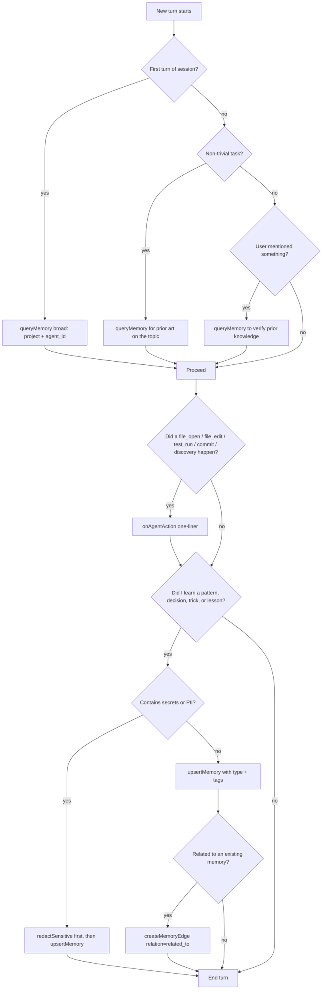

# memorymcp — auto-use policy

Treat memorymcp as a reflex, not a lookup DB. The tools are local, fast, and side-effect cheap.

## Contract (binding)

1. **First action of a session** → call `queryMemory` for project / agent context.
2. **Before any non-trivial task** → call `queryMemory` for prior art on the topic.
3. **After every file_open, file_edit, test_run, commit, or discovery** → call `onAgentAction` (one-liner, cheap).
4. **End of task / before context compaction** → call `upsertMemory` for any new pattern, decision, or lesson.

If your client does not support skills, call `getMemoryCheatsheet()` at session start, or `getMemoryAutousePolicy()` for the full body. Both MCP tools return the same content as this file.

## 4-line end-of-turn checklist

```
query ✓   store ✓   link ✓   self-check done ✓
```

Run it mentally at the end of every turn. If any box is unchecked and the relevant trigger fired, fix it before yielding.

## Decision tree



## Quick recipes (copy-paste)

**After solving a tricky bug**
```python
upsertMemory(
    text="Root cause was X; fixed by Y. Side effect: Z.",
    memory_type="lesson",
    tags=["bug", "root-cause"],
    source="<file:line>",
)
```

**After reading unfamiliar code**
```python
onAgentAction(
    action_type="file_open",
    context="<one-sentence summary of what this module does and why it matters>",
    path="<file>",
)
```

**After making an architectural decision**
```python
upsertMemory(
    text="Chose X over Y because Z. Trade-off: W.",
    memory_type="architectural_decision",
    tags=["architecture", "decision"],
    retention_policy="permanent",
)
```

**When stuck**
```python
queryMemory(query="<error or symptom>", k=5)
```

**After a test run that reveals something**
```python
onAgentAction(
    action_type="test_run",
    context="<what passed, what failed, what surprised you>",
    tags=["test"],
)
```

**Before recommending a refactor**
```python
queryMemory(query="<module or pattern you are about to refactor>", k=5)
```

**Link two related memories**
```python
createMemoryEdge(
    from_id="<new_memory_id>",
    to_id="<existing_memory_id>",
    relation="refines",  # or depends_on, follows, contradicts, example_of
)
```

## Tag conventions (use these, keep them stable)

| Tag | When |
|---|---|
| `pattern` | reusable code idiom |
| `architecture` | design / system-level insight |
| `trick` | clever workaround |
| `lesson` | mistake to avoid |
| `plan` | roadmap / future work |
| `decision` | a choice with rationale |
| `bug` | root cause or regression |
| `perf` | performance observation |

## Two levels of architectural analysis

Architectural knowledge has two scopes. **Tag every memory with one of these** so the LLM can ask the right question later:

| Tag | When | Cardinality | Examples |
|---|---|---|---|
| `level:meta` | Big design call: WHY this choice over alternatives, what trade-off, what invariant is being protected | 1-3 per topic (lives for the life of the system) | "Why unified launcher process", "Why dual-store memorymcp", "Why OAuth suppression trick", "Why fail-closed on security" |
| `level:detail` | Concrete pattern: HOW a piece works, what formula/code/rule applies | Many per topic (lives until superseded) | "Token bucket refill formula", "ON CONFLICT (text_hash) DO UPDATE", "scroll_all paginated wrapper", "Idempotent patching via attribute" |

**Question routing:**
- "Why was X built this way?" / "What are the trade-offs of X?" → call `getMetaDecisions(query)` — returns only `level:meta` memories.
- "How do I do X?" / "Show me the code" → call `queryMemory(query)` — returns both levels, the LLM reads the type and tags to decide which to use.
- For the big picture, also call `exportGraphAsMarkdown(tag="level:meta")` to see all meta decisions as a graph.

**Graph structure:** store the big call as `level:meta`, then store each of its patterns as `level:detail`, and link them with `createMemoryEdge(from_id=detail, to_id=meta, relation="refines")` or `relation="example_of"`. The graph becomes `meta → detail` and `getMemoryGraph(meta_id, depth=2)` returns the full decision + all its patterns.

**Anti-pattern:** do NOT mark everything `level:meta` — it dilutes the signal. The meta layer is a CURATED set, not a dump. If a topic has 5+ `level:meta` memories, they probably aren't meta.

## Priority (a third classification axis on top of level)

Memories also have a priority — how critical is it that the LLM knows this? Use this axis when the context budget is tight and you need to triage what to retrieve.

| Tag | Meaning | Cardinality | When to use |
|---|---|---|---|
| `priority:A` | **must-know** — central to understanding the system, can't be missed | ~1-2 per topic | "What do I NEED to know to work in this codebase?" |
| `priority:B` | **should-know** — comes up frequently in real work | ~5-10 per topic | Default for most concrete patterns |
| `priority:C` | **nice-to-know** — useful in specific contexts, can be deferred | unbounded | Edge cases, exotic parameters, very specific recipes |

The three axes compose freely:

| Example composition | Meaning |
|---|---|
| `memory_type=architectural_decision + level:meta + priority:A` | A must-know big design call (e.g., "Why unified launcher process") |
| `memory_type=code_pattern + level:detail + priority:A` | A must-know concrete pattern (e.g., "ON CONFLICT (text_hash) DO UPDATE" — central to memorymcp) |
| `memory_type=trick + level:detail + priority:B` | A useful trick, default priority |
| `memory_type=lesson + level:detail + priority:C` | A specific edge case, defer if context tight |

**Question routing with priority:**
- "What's critical to know about X?" → `queryMemory(query, tags=["priority:A"])` (any level)
- "What are the must-know big decisions about X?" → `getMetaDecisions(query)` (defaults to `priority:A` + `level:meta`)
- "Show me all relevant patterns" → `queryMemory(query)` (all priorities, both levels)
- "I have very little context left, what do I really need?" → first `getMetaDecisions(query, priority="A")`, then `queryMemory(query, tags=["priority:A"])` for any-level must-knows.

**Anti-pattern:** do NOT mark everything `priority:A` — same as level:meta, it dilutes the signal. If 20 memories in a topic are all `priority:A`, none of them are. The priority axis is for TRIAGE under tight context, not for ranking your favorite memories.

## Retention policy

| Policy | Use for |
|---|---|
| `permanent` | decisions, architecture, lessons learned the hard way |
| `temp` | in-flight context, scratch notes, current-task state |
| `auto-delete` (default) | transient observations, single-use tricks |

## Anti-patterns — do NOT

- do NOT skip `queryMemory` because the task looks small.
- do NOT store secrets, keys, tokens, or personal data — call `redactSensitive` first if unsure.
- do NOT store the same insight twice — `queryMemory` first, then `upsertMemory` with the existing `memory_id` to update.
- do NOT store generic LLM filler ("this is a function that takes a string"). Store the *non-obvious* part.
- do NOT store without a `memory_type` and at least one tag — untyped memories are unfindable.
- do NOT forget `onAgentAction` on file_open / file_edit / test_run / commit — these are the cheapest, highest-signal captures.

## Graph & smart-graph hooks

- After every successful `upsertMemory`, ask: is this `refines` / `depends_on` / `contradicts` an existing memory? If yes, `createMemoryEdge`.
- When ingesting a long doc (README, skill file, architecture note) into working context, run it through `textToGraph` with `output="adjacency"` first — LLMs reason better over graphs than over flat text.
- For docs you will re-read many times, run `textToSmartGraph` once and cache the compressed output.

## Self-check (run at end of every turn)

1. Did I `queryMemory` before starting the task? If not, do it now.
2. Did I `upsertMemory` or `onAgentAction` for every non-trivial thing I learned? If not, do it now.
3. Did I `createMemoryEdge` for any new memory that relates to an existing one? If not, do it now.

## Self-pointer

If this content is unavailable through your client, the same content is served by these MCP tools on the `memorymcp` server:

- `getMemoryAutousePolicy()` — full body (this file)
- `getMemoryCheatsheet()` — short summary, for tight context budgets
